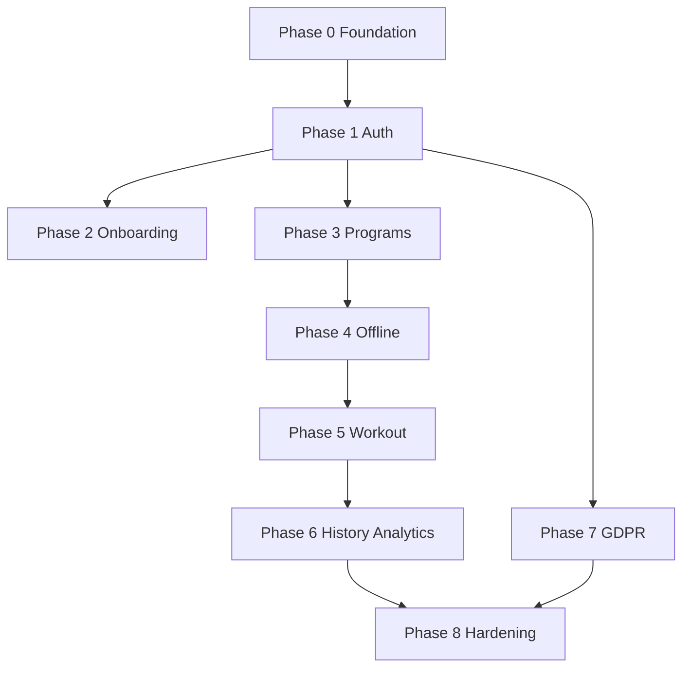

# OneMore — Implementation Roadmap

**Version:** 1.0  
**Date:** 2026-06-10  
**Target:** MVP-1 Athlete Core (~8–10 weeks) → MVP-2 → MVP-3 → V2 billing  
**References:** [Technical Spec v1](./Technical_Spec_v1.md) | [MVP MoSCoW](./prd/OneMore_MVP_MoSCoW.md) | [ADR index](./adr/0000-adr-index.md)

---

## Pre-implementation decisions — status

| Topic | Decision | Notes |
|-------|----------|-------|
| Architecture | Closed | ADRs 0001–0012 |
| Monetization | Closed | Freemium 3 clients; Pro €29/mo placeholder; marketplace 15% |
| Domains | **onemore.com** (provisional) | `app.onemore.com`, `api.onemore.com`; change before prod OAuth |
| Exercise seed | **Open dataset** | wger.de API (CC-BY-SA) — review + curate ~150 for MVP-1 |
| Design | **shadcn/ui defaults** | Mobile-first; brand/logo later |
| Program templates | **4 engineering-defined** | See [Seed Content](./prd/OneMore_Seed_Content.md) |
| Legal policies | Before public launch | Templates in `docs/legal/` — not blocking dev |

**No further product/architecture decisions required to start coding.**

---

## Team allocation (10 people)

| Track | People | MVP-1 focus |
|-------|--------|-------------|
| Backend | 3 | API, Prisma, sync, jobs, auth |
| Frontend | 2 | Next.js app, workout UI, program builder |
| Mobile/PWA | 3 | Offline, Dexie, PWA, performance, touch UX |
| Design | 2 | Workout flows, shadcn patterns, responsive |

---

## Git strategy

```bash
# Start
git checkout -b feat/mvp1-monorepo-bootstrap

# Feature branches
feat/mvp1-*

# Tag at MVP-1 go-live
git tag v0.1.0
```

---

## Phase 0 — Foundation (Week 1)

**Goal:** Empty monorepo runs locally; CI green; DB migrates.

| ID | Task | Owner | Done when |
|----|------|-------|-----------|
| P0-01 | Init Turborepo: `apps/web`, `services/api`, `packages/shared`, `packages/ui`, `packages/api-client` | Backend+FE | `pnpm dev` starts web + api |
| P0-02 | TypeScript strict, ESLint, shared eslint-config | FE | CI lint passes |
| P0-03 | `docker/compose.dev.yml`: postgres, pgbouncer, redis | Backend | `docker compose up` healthy |
| P0-04 | Prisma schema per [Data Model v1.2](./prd/OneMore_Data_Model.md) MVP-1 tables | Backend | `prisma migrate dev` works |
| P0-05 | Express app skeleton: health, `/api/v1`, error handler, pino | Backend | `GET /health` 200 |
| P0-06 | Next.js 15 App Router, Tailwind, shadcn init in `packages/ui` | FE | Storybook or demo page |
| P0-07 | `next-intl`: locales `it`, `en` | FE | Language switch works |
| P0-08 | Zod schemas in `packages/shared` for core entities | Backend | Imported by api + web |
| P0-09 | GitHub Actions: lint, test, build, npm audit | Backend | PR checks green |
| P0-10 | `.env.example` all services | Backend | Documented in README |

**Exit criteria:** Developer clones repo → docker up → migrate → web on :3000, api on :4000.

---

## Phase 1 — Auth & users (Week 2)

**Maps to:** M1-01, M1-13 (partial)

| ID | Task | Owner | Done when |
|----|------|-------|-----------|
| P1-01 | `auth` module: register, login, logout, refresh cookie | Backend | Vitest integration tests |
| P1-02 | Password reset flow + Resend email job | Backend | Email received in dev |
| P1-03 | OAuth Apple + Google (`arctic`) — dev redirect URLs | Backend | OAuth login works locally |
| P1-04 | Account linking by email | Backend | Test: Google on existing email |
| P1-05 | `users` module: profile CRUD, username rules | Backend | Username cooldown enforced |
| P1-06 | `consent_record` on signup (TOS, privacy, fitness data) | Backend | AC-RBAC-06 age ≥16 |
| P1-07 | Rate limiting Redis: login 5/15min/IP | Backend | Test blocked after 6 attempts |
| P1-08 | Web: `/login`, `/register`, `/forgot-password` | FE | Responsive mobile |
| P1-09 | Web: auth middleware, token refresh proxy | FE | Session persists 7d |
| P1-10 | `audit_log` for auth events | Backend | Login logged |
| P1-11 | OpenAPI routes for auth/users | Backend | Spectral lint CI |

**Exit criteria:** User can register, login, OAuth, reset password, edit profile.

---

## Phase 2 — Onboarding (Week 3)

**Maps to:** M1-02

| ID | Task | Owner | Done when |
|----|------|-------|-----------|
| P2-01 | Onboarding API: save goals, level, availability, environment, motivation_level | Backend | Persisted on user |
| P2-02 | Web: multi-step onboarding (mobile-first) | FE+Design | AC 60% completion trackable |
| P2-03 | Post-onboarding: offer template selection OR manual program | FE | Routes to program flow |
| P2-04 | PostHog events: `onboarding_step_completed`, `onboarding_completed` | FE | Events in PostHog dev |
| P2-05 | Empty dashboard state for new user | FE+Design | Clear CTA start workout |

**Exit criteria:** New user completes onboarding in &lt;10 min median (measure in beta).

---

## Phase 3 — Programs & exercise library (Week 4)

**Maps to:** M1-03, M1-04, M1-07

| ID | Task | Owner | Done when |
|----|------|-------|-----------|
| P3-01 | `programs` module: CRUD, ProgramVersion publish | Backend | Version immutability |
| P3-02 | `exercises` module: list, search tsvector, custom exercise | Backend | Search &lt;300ms p95 |
| P3-03 | Seed script: import from wger.de API → curate 150 exercises | Backend | `pnpm seed` idempotent |
| P3-04 | Legal review note on wger CC-BY-SA attribution in app | — | Footer/credits page |
| P3-05 | Seed 4 program templates (JSON) — see Seed Content doc | Backend | Templates in DB |
| P3-06 | Web: program builder (days, exercises, sets/reps/weight/rest) | FE | Create manual program |
| P3-07 | Web: template picker at onboarding | FE | Apply template → program |
| P3-08 | Web: exercise library search + custom exercise form | FE | Mobile usable |
| P3-09 | API client package typed methods | FE | No `any` |

**Exit criteria:** User creates or picks template program with exercises.

---

## Phase 4 — Offline layer (Week 5)

**Maps to:** M1-06 foundation

| ID | Task | Owner | Done when |
|----|------|-------|-----------|
| P4-01 | Dexie schema mirrors server entities + sync_queue | Mobile | Schema versioned |
| P4-02 | `packages/api-client` sync: push batch, pull delta | Backend+Mobile | Idempotency tests |
| P4-03 | `POST /api/v1/sync/batch` + `GET /sync/delta` | Backend | AC-WO-02 |
| P4-04 | Download full exercise catalog on login | Mobile | Offline catalog browse |
| P4-05 | Download active program snapshot | Mobile | Offline program view |
| P4-06 | Sync status UI: pending badge, retry | FE | Non-blocking |
| P4-07 | Vitest: 100% coverage sync merge logic | Backend | CI enforced |

**Exit criteria:** Log sets offline; reconnect syncs to server.

---

## Phase 5 — Workout execution (Week 6)

**Maps to:** M1-05, M1-11, S1-01–S1-04

| ID | Task | Owner | Done when |
|----|------|-------|-----------|
| P5-01 | `workouts` module: start, log set, complete, abandon | Backend | State machine correct |
| P5-02 | Web: workout screen — 1–2 tap set complete | Mobile+FE | AC-WO-01 UX test |
| P5-03 | Weight/reps steppers, skip set, skip exercise | Mobile | Touch 44px |
| P5-04 | Rest timer + Web Push when backgrounded | Mobile | AC-WO-05 |
| P5-05 | Auto-fill from last session (S1-01) | Mobile | Pre-filled values |
| P5-06 | Exercise substitution session-level (S1-04) | Mobile+Backend | Analytics on actual exercise |
| P5-07 | Free workout flow (M1-11) | FE | session_type=free |
| P5-08 | Session private notes (S1-02) | FE+Backend | Synced |
| P5-09 | Crash resume: persist every set, resume prompt | Mobile | AC-WO-03, AC-WO-04 |
| P5-10 | Serwist PWA: install prompt, app shell cache | Mobile | Installable |

**Exit criteria:** Full workout offline → online; p95 set log ≤100ms local.

---

## Phase 6 — PR, history, analytics (Week 7)

**Maps to:** M1-08, M1-09, M1-10, S1-03

| ID | Task | Owner | Done when |
|----|------|-------|-----------|
| P6-01 | PR detection service (Algorithm Spec §3) | Backend | AC-e1RM tests pass |
| P6-02 | PR celebration in-app (+ optional push) | FE | `pr_achieved` event |
| P6-03 | History API: list, detail, date filter | Backend | Pagination |
| P6-04 | Web: history list + session detail | FE | Mobile scroll |
| P6-05 | Analytics: weekly volume, frequency, streak | Backend | ISO week boundaries |
| P6-06 | Web: dashboard widgets — next/last workout, streak, PRs | FE | S1-03 |
| P6-07 | Define "next workout" = rotate program days by last completed | Backend+FE | Documented in code |

**Exit criteria:** Dashboard shows progress; PR fires on improvement.

---

## Phase 7 — GDPR, notifications, observability (Week 8)

**Maps to:** M1-12, M1-13

| ID | Task | Owner | Done when |
|----|------|-------|-----------|
| P7-01 | GDPR export job: JSON+CSV → R2 signed URL → Resend | Backend | Self-service &lt;24h |
| P7-02 | Account deletion: soft 30d → hard delete job | Backend | AC-RBAC-05 |
| P7-03 | Web Push VAPID: workout reminders (user schedule) | Backend+FE | M1-12 |
| P7-04 | Settings: notification preferences, motivation level | FE | Level 1 default behavior |
| P7-05 | Sentry web + api | All | Errors reported |
| P7-06 | PostHog EU: full event catalog MVP-1 | FE | Funnels dashboard |
| P7-07 | Strict PII-free logging audit | Backend | No email in logs |

**Exit criteria:** Export + delete work; reminders fire; analytics live.

---

## Phase 8 — Hardening & beta (Week 9–10)

| ID | Task | Owner | Done when |
|----|------|-------|-----------|
| P8-01 | Playwright E2E: register → onboarding → workout → sync | FE | CI nightly |
| P8-02 | k6 load test: 200–500 concurrent | Backend | Report archived |
| P8-03 | WCAG spot-check workout screen | Design+FE | Touch targets, contrast |
| P8-04 | `docker/compose.prod.yml` + GHCR deploy workflow | Backend | Staging deploy |
| P8-05 | Cloudflare DNS → NPM → VPS | Backend | TLS valid onemore.com |
| P8-06 | Uptime Kuma monitors | Backend | Alerts configured |
| P8-07 | Pentest or structured security review | Backend | Before public launch |
| P8-08 | Beta cohort 50 users on staging/prod | Product | Go-live criteria tracked |
| P8-09 | Runbooks: deploy, restore DB | Backend | `docs/runbooks/` |
| P8-10 | Tag `v0.1.0` | — | MVP-1 release |

**MVP-1 go-live checklist:** [MoSCoW §3](./prd/OneMore_MVP_MoSCoW.md#mvp-1-go-live-criteria)

---

## Phase 9 — MVP-2 Coach Lite (Weeks 11–18)

| Sprint | Focus | Key IDs |
|--------|-------|---------|
| M2-S1 | Coach role, DPA acceptance, coach onboarding | M2-01 |
| M2-S2 | Invite link, consent gate, relationship lifecycle | M2-02, M2-03 |
| M2-S3 | Program assignment, client list/detail | M2-04–M2-06 |
| M2-S4 | E2E messaging (libsodium), WebSocket | M2-07, M2-08 |
| M2-S5 | Coach dashboard, coach notes in workout | M2-09, M2-10 |
| M2-S6 | Profile images R2, CSP strict coach routes | ADR 0009 |
| M2-S7 | Beta coach cohort, tag `v0.2.0` | |

---

## Phase 10 — MVP-3 Coach Pro (Weeks 19–28)

CRM pipeline, automation, multi-coach RBAC, progression engine, plateau, goals, Progress Score, advanced analytics, video upload — see [MoSCoW MVP-3](./prd/OneMore_MVP_MoSCoW.md#5-mvp-3--coach-pro). Tag `v0.3.0`.

---

## Phase 11 — V2 billing & integrations (post MVP-3)

| Item | Reference |
|------|-----------|
| Stripe Coach Pro €29/mo | [ADR 0011](./adr/0011-monetization-and-legal-model.md), [Billing UX](./prd/OneMore_Coach_Billing_UX.md) |
| Strong/Hevy import | MoSCoW V2 |
| Google Calendar | MoSCoW V2 |
| More EU languages | i18n expansion |
| Legal policies published | `docs/legal/` |

---

## Phase 12 — V4 Marketplace

Stripe Connect, 15% fee, marketplace listings — ADR 0011.

---

## Dependency graph (MVP-1)



---

## First command sequence (Phase 0)

```bash
# After P0-01 implemented
pnpm install
docker compose -f docker/compose.dev.yml up -d
pnpm --filter api prisma migrate dev
pnpm dev
```

---

## Risk register (MVP-1)

| Risk | Mitigation |
|------|------------|
| iOS PWA offline sync | Sync badge; monitor failure rate; native decision gate |
| wger license | CC-BY-SA attribution page; curate don't copy blindly |
| onemore.com not final | Env-based URLs; update OAuth before prod |
| 100% test coverage goal | 100% on sync/auth/algorithms; 80% overall |
