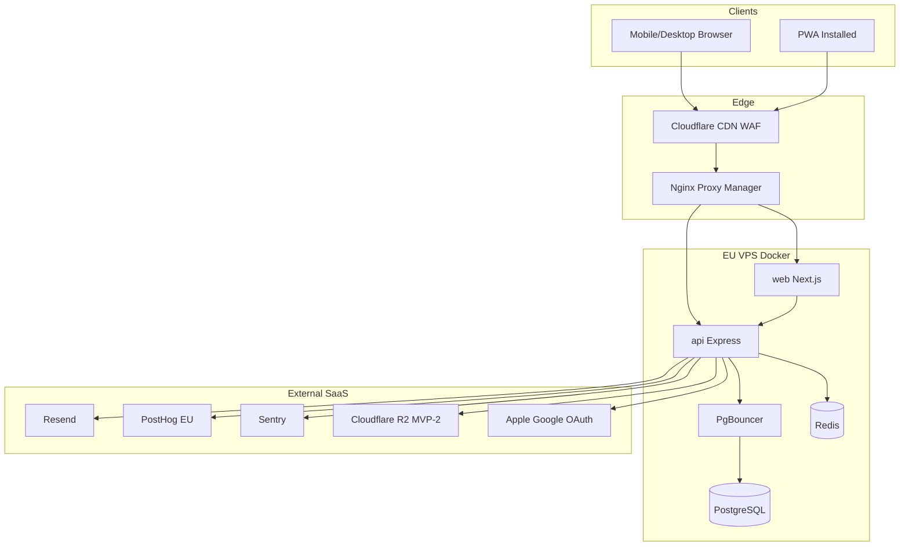

# OneMore — Technical Specification v1

**Version:** 1.0  
**Date:** 2026-06-10  
**Status:** Approved for implementation  
**Related:** [ADR Index](./adr/0000-adr-index.md) | [PRD Supplements](./prd/README.md)

---

## 1. Executive summary

OneMore V1 is a **responsive web SPA + PWA** (not native mobile) targeting the **European market** with **Italian and English** UI. The athlete experience ships first (MVP-1); coach features follow in MVP-2/3. Infrastructure is **self-hosted on EU VPS via Docker**, with **Cloudflare** at the edge.

| Dimension | Decision |
|-----------|----------|
| Platform V1 | Next.js 15 PWA — mobile + desktop browser |
| Native apps | Deferred post-V1 evaluation |
| Backend | Node.js 22 + Express modular monolith |
| API | REST `/api/v1` |
| Database | PostgreSQL 16 + Prisma + PgBouncer |
| Cache / queue | Redis 7 + BullMQ |
| Offline | IndexedDB (Dexie) + custom sync batch |
| Auth | Custom JWT + OAuth (Apple, Google) |
| Analytics | PostHog EU Cloud |
| Email | Resend |
| Target MAU (12 mo) | 10,000 |
| SLA | Best-effort (internal ~99%) |
| Monetization | Free V1; Coach freemium V2 (3 clients free → Coach Pro); Stripe Connect marketplace V4 |

---

## 2. System context



---

## 3. Monorepo structure

```
onemore/
├── apps/
│   └── web/                    # Next.js 15 — athlete + coach UI
├── services/
│   └── api/                    # Express modular monolith
├── packages/
│   ├── shared/                 # Zod schemas, types, i18n
│   ├── api-client/             # Typed REST + sync client
│   ├── ui/                     # shadcn design system
│   └── eslint-config/
├── docs/
│   ├── adr/
│   ├── prd/
│   ├── legal/                  # Policy templates (to author)
│   └── runbooks/
├── docker/
│   ├── compose.prod.yml
│   ├── compose.staging.yml
│   └── compose.dev.yml
└── turbo.json
```

---

## 4. Frontend architecture

### 4.1 Stack

| Component | Technology |
|-----------|------------|
| Framework | Next.js 15 App Router (`standalone` Docker output) |
| UI | Tailwind CSS 4 + shadcn/ui |
| Server state | TanStack Query v5 |
| Workout / offline | Zustand + Dexie.js (IndexedDB) |
| i18n | next-intl — `it`, `en` from MVP-1 |
| PWA | Serwist Service Worker |
| Forms | React Hook Form + Zod |

### 4.2 Route structure (high level)

| Route group | Audience | MVP |
|-------------|----------|-----|
| `/` `/dashboard` | Athlete | MVP-1 |
| `/workout/*` | Athlete | MVP-1 |
| `/programs/*` | Athlete | MVP-1 |
| `/history/*` | Athlete | MVP-1 |
| `/coach/*` | Coach | MVP-2+ |
| `/settings/*` | All | MVP-1 |

### 4.3 Responsive breakpoints

| Name | Width | Primary use |
|------|-------|-------------|
| `mobile` | &lt; 768px | Workout execution, athlete mobile |
| `tablet` | 768–1024px | Coach phone |
| `desktop` | &gt; 1024px | Coach dashboard, analytics |

### 4.4 PWA requirements

- Install prompt after second workout completed
- Service Worker caches app shell + exercise catalog
- Web Push (VAPID) for reminders MVP-1
- Offline indicator + sync pending badge

### 4.5 iOS PWA limitations (documented risk)

- Background sync unreliable — user must open app online to sync
- Storage quota ~50MB–1GB — monitor IndexedDB size
- Web Push on iOS 16.4+ only when installed to home screen

---

## 5. Backend architecture

### 5.1 Modular monolith modules

See [ADR 0003](./adr/0003-backend-api-architecture.md).

### 5.2 API conventions

```
Base URL: https://api.onemore.example/api/v1
Auth: Bearer access token (memory) + httpOnly refresh cookie
Content-Type: application/json
Idempotency-Key: required on POST /sync/batch and financial mutations (V2)
```

### 5.3 Core endpoints (MVP-1)

| Method | Path | Description |
|--------|------|-------------|
| POST | `/auth/register` | Email/password signup |
| POST | `/auth/login` | Login |
| POST | `/auth/oauth/{provider}` | Apple/Google |
| POST | `/auth/refresh` | Rotate refresh cookie |
| POST | `/auth/logout` | Revoke refresh |
| GET | `/users/me` | Profile |
| PATCH | `/users/me` | Update profile / username |
| GET | `/exercises` | Library (paginated + search) |
| CRUD | `/programs/*` | Program management |
| POST | `/workouts/sessions` | Start session |
| POST | `/sync/batch` | Offline sync upload |
| GET | `/sync/delta` | Pull server changes |
| GET | `/history/sessions` | Workout history |
| POST | `/users/me/export` | Trigger GDPR export job |
| DELETE | `/users/me` | Request account deletion |

OpenAPI spec: `services/api/openapi.json` — linted in CI.

### 5.4 Background jobs (BullMQ)

| Job | Trigger | MVP |
|-----|---------|-----|
| `send-email` | Auth, export ready | MVP-1 |
| `gdpr-export` | User request | MVP-1 |
| `hard-delete-user` | 30d after soft delete | MVP-1 |
| `weekly-analytics` | Cron Sunday | MVP-3 |
| `backup-verify` | Cron daily | MVP-1 |

---

## 6. Offline sync

See [ADR 0005](./adr/0005-offline-sync-protocol.md).

### Sync batch payload (example)

```json
{
  "client_sync_id": "uuid",
  "since": "2026-06-01T00:00:00Z",
  "mutations": [
    {
      "type": "set_log",
      "id": "client-uuid",
      "op": "upsert",
      "payload": { ... },
      "client_timestamp": "2026-06-10T12:00:00Z"
    }
  ]
}
```

### Coach-athlete sync model

- Athlete offline changes sync on reconnect → coach sees updated data after sync
- Coach actions (assign program, message) require online — pushed via WebSocket or delta pull (MVP-2)
- Coach client list shows `last_synced_at` per client

---

## 7. Authentication

See [ADR 0006](./adr/0006-authentication-and-identity.md).

### Username rules

| Rule | Value |
|------|-------|
| Format | 3–30 chars, alphanumeric + underscore |
| Uniqueness | Case-insensitive |
| First change | Anytime after signup |
| Second change | ≥30 days after first change |
| Subsequent | Max 1 change per 6 months |

### OAuth providers (MVP-1)

- Apple Sign In
- Google Sign In

### MFA

- TOTP optional — user settings; coach onboarding recommends enable (MVP-2)

---

## 8. Data layer

See [ADR 0004](./adr/0004-database-and-persistence.md) and [Data Model v1.2](./prd/OneMore_Data_Model.md).

Key v1.2 decisions:

- Auth: `user_credential`, `oauth_account`, `refresh_token`, `password_reset_token`
- Program rotation: `program_assignment.next_workout_day_id`
- Workout history: `prescription_snapshot` on `exercise_execution`
- Progress: `body_weight_log`, `user_achievement`; fixed `personal_record` uniqueness
- Messaging: E2E only (`body_encrypted`); no server `sync_status` on sessions
- Billing: `coach_subscription` without per-row price (Stripe catalog)

### Supplemental entities

| Entity | Purpose |
|--------|---------|
| `system_settings` | Admin media limits |
| `audit_log` | Coach reads + security events |
| `sync_idempotency` | Idempotency key store |
| `media_asset` | R2 metadata MVP-2+ |
| `progression_proposal` | Coach-approved program changes MVP-3 |
| `oidc_provider_config` | Enterprise stub |

---

## 9. Security

See [ADR 0008](./adr/0008-security-observability-testing.md).

### Rate limits (Redis)

| Endpoint class | Limit |
|----------------|-------|
| Login | 5 / 15 min / IP |
| Register | 3 / hour / IP |
| API general | 300 / min / user |
| Sync batch | 120 / min / user |

### Messaging E2E (MVP-2)

- libsodium-based channel encryption
- Keys exchanged during online session
- Server stores encrypted blobs only — no plaintext at rest
- Offline compose queues encrypted payload until send

### Audit log

Log **all** coach access to client data:

- `coach_viewed_client_profile`
- `coach_viewed_client_workouts`
- `coach_viewed_client_analytics`
- Plus all writes, consent changes, exports, deletes

---

## 10. GDPR & compliance

| Requirement | Implementation |
|-------------|----------------|
| Age ≥16 | `birth_year` validation on register |
| Fitness data consent | Separate checkbox at onboarding |
| Export | Self-service → BullMQ job → R2 signed URL → Resend email |
| Deletion | Soft 30d → hard delete job |
| Cookie banner | MVP-2 when analytics/marketing cookies beyond functional |
| Policy templates | `docs/legal/` — internal templates to author |
| PostHog | EU cloud, no PII in event properties |

### Coach DPA (accepted — ADR 0011)

- **Workout / analytics data:** OneMore = processor; athlete = controller of own data
- **CRM data (leads, pipeline, notes):** Coach = controller; OneMore = processor
- DPA template accepted at coach onboarding MVP-2
- Athlete coach-link consent remains separate flow
- Legal templates require external review before public launch

---

## 11. Infrastructure

See [ADR 0007](./adr/0007-infrastructure-and-deployment.md).

### Environments

| Env | Web | API | Data |
|-----|-----|-----|------|
| dev | `localhost:3000` | `localhost:4000` | local Docker |
| staging | `staging.onemore.com` | `api.staging.onemore.com` | synthetic |
| production | `app.onemore.com` | `api.onemore.com` | live |

Domain **onemore.com** is provisional (ADR 0012). All URLs from env vars.

### CI/CD pipeline

1. PR → lint, test, build, OpenAPI lint, npm audit
2. Merge to `main` → build images → push GHCR
3. Manual or auto deploy staging
4. Promote to production via tagged release

### Backup

- Daily `pg_dump` → R2 encrypted
- RPO 24h, RTO 4h
- 90-day retention

### Region

- **Hetzner Frankfurt** (primary recommendation) or equivalent EU VPS

---

## 12. Observability

| Tool | Purpose |
|------|---------|
| Sentry | Errors + performance (web, api) |
| PostHog EU | Product analytics, funnels, North Star |
| Uptime Kuma | Uptime checks |
| pino | Structured JSON logs (no PII) |
| Unleash | Feature flags MVP-2 |

### Alerting

- Uptime Kuma → Slack/email on prod down
- Sentry → Slack on new critical issues

---

## 13. Media (phased)

See [ADR 0009](./adr/0009-media-storage-mvp-phases.md).

| MVP | Assets |
|-----|--------|
| MVP-1 | None |
| MVP-2 | Profile images, exercise images — R2 + admin size limits |
| MVP-3 | Exercise videos — R2 + admin duration/size limits |

---

## 14. Testing strategy

| Layer | Tool | Target |
|-------|------|--------|
| Unit | Vitest | ≥80% overall |
| Critical paths | Vitest | 100% — sync, auth, PR algorithms |
| Integration | Vitest + test DB | API modules |
| Contract | OpenAPI Spectral | CI fail on breaking undocumented change |
| E2E | Playwright | Athlete workout happy path, auth, sync |
| Load | k6 | 200–500 concurrent before public launch |

---

## 15. Team & process

| Role | Count | Focus V1 |
|------|-------|----------|
| Mobile* | 3 | PWA mobile UX, offline, workout |
| Backend | 3 | API, sync, auth, jobs |
| Frontend | 2 | Web UI, coach layouts MVP-2 |
| Design | 2 | Mobile-first workout, design system |

\*Mobile team works on responsive PWA mobile experience until native decision.

### Definition of Done

- Code + tests + review + ADR if architectural
- OpenAPI updated for API changes
- i18n strings for `it` and `en` for user-facing changes

---

## 16. Roadmap alignment (technical)

| Feature | Phase | Notes |
|---------|-------|-------|
| Athlete web PWA | MVP-1 | |
| Coach web (responsive) | MVP-2 | |
| CRM, automation | MVP-3 | |
| Stripe Coach Pro (freemium) | V2 | Free ≤3 clients; flat Pro above — [ADR 0011](./adr/0011-monetization-and-legal-model.md) |
| Strong/Hevy import | V2 | |
| Google Calendar | V2 | |
| More EU languages | V2–V3 | |
| Exercise video | MVP-3 | |
| Smartwatch companion | V3 | |
| Marketplace (Stripe Connect) | V4 | Connected accounts + platform fee — ADR 0011 |
| Enterprise SSO | Enterprise tier | ADR 0010 |

---

## 17. Monetization & legal (decided)

See [ADR 0011](./adr/0011-monetization-and-legal-model.md).

| Topic | Decision |
|-------|----------|
| Coach pricing V2 | **Freemium:** 3 free clients; **Coach Pro €29/month** (placeholder) for 4+ |
| Athlete pricing | **Free** (V1–V2) |
| Marketplace V4 | **Stripe Connect**; **15%** platform fee (placeholder) |
| GDPR roles | Coach **controller** for CRM; OneMore **processor** for workout data; DPA at coach signup |
| Upgrade UX | Block only **new client** when `active >= 3` without Pro → modal → `/coach/billing` |
| Lapse UX | Existing clients stay **fully manageable**; same add-client gate |

Detail: [OneMore_Coach_Billing_UX.md](./prd/OneMore_Coach_Billing_UX.md) | [ADR 0011](./adr/0011-monetization-and-legal-model.md)

**Revise before launch:** €29/month and 15% marketplace fee are placeholders.

---

## 18. Document index

| Document | Path |
|----------|------|
| ADRs | `docs/adr/` |
| PRD supplements | `docs/prd/` |
| This spec | `docs/Technical_Spec_v1.md` |
| Legal templates (TODO) | `docs/legal/` |
| Runbooks (TODO) | `docs/runbooks/` |
