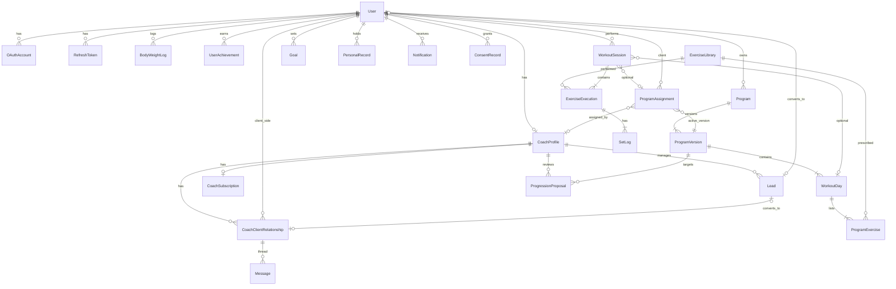
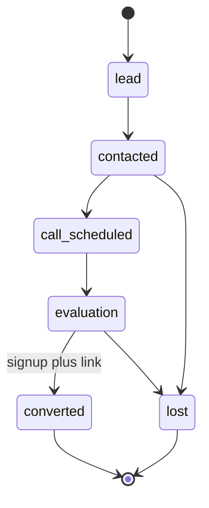
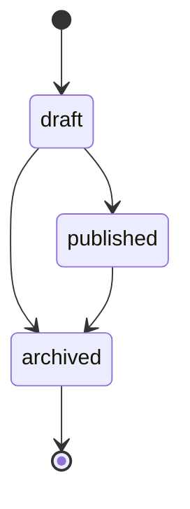
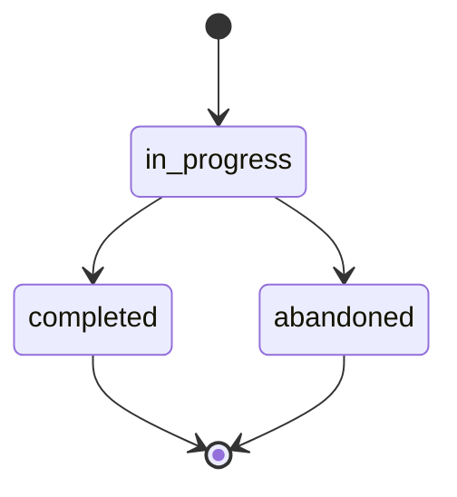
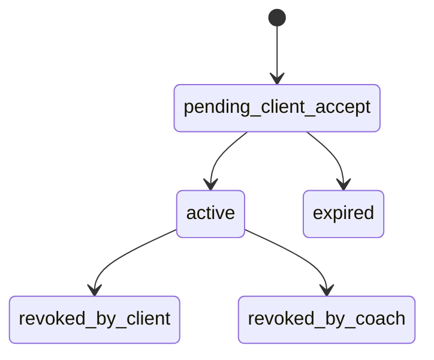

# OneMore — Data Model & Entity Lifecycle

**Version:** 1.2  
**Changelog:** Auth tables, program rotation, PR index fix, snapshot prescription, removed redundancies — see §12.  
**Parent document:** [OneMore_PRD_Enterprise_v1.md](../../OneMore_PRD_Enterprise_v1.md)  
**Architecture:** [Technical Spec v1](../Technical_Spec_v1.md) | [ADR 0004](../adr/0004-database-and-persistence.md)

---

## 1. Overview

PostgreSQL 16, Prisma ORM. UUID primary keys (`id`). All tables: `created_at`, `updated_at` unless noted.

**Conventions:**

- `snake_case` tables and columns
- Soft delete via `deleted_at` where listed
- Auth credentials isolated in dedicated tables (`oauth_account`, `refresh_token`, …)
- `user` holds profile + preferences; not password/OAuth secrets beyond flags

---

## 2. Core ER Diagram



---

## 3. Authentication & identity (MVP-1)

### 3.1 User

Profile, preferences, onboarding. **No** password hash or OAuth ids here.

| Column | Type | Notes |
|--------|------|-------|
| id | UUID PK | |
| email | VARCHAR UNIQUE | login identifier |
| email_verified_at | TIMESTAMP | null until verified; OAuth sets on link |
| display_name | VARCHAR | |
| username | VARCHAR UNIQUE | case-insensitive index on `lower(username)` |
| username_changed_at | TIMESTAMP | cooldown policy §11 |
| birth_year | INT | min age 16 |
| locale | VARCHAR | `it` \| `en` |
| height_cm | DECIMAL | optional |
| weight_kg | DECIMAL | **cache** of latest body_weight_log |
| timezone | VARCHAR | IANA |
| motivation_level | INT | 1, 2, or 3 |
| fitness_data_consented_at | TIMESTAMP | explicit GDPR fitness consent |
| onboarding_completed_at | TIMESTAMP | null until done |
| training_goal | ENUM | mass, strength, fat_loss, recomp, fitness |
| training_level | ENUM | beginner, intermediate, advanced |
| training_environment | ENUM | gym, home |
| training_days_per_week | INT | from onboarding |
| is_coach | BOOLEAN | true when coach_profile exists |
| mfa_enabled | BOOLEAN | default false |
| totp_secret_encrypted | BYTEA | null if MFA off |
| settings | JSONB | units, notification prefs, quiet hours, auto-progression |
| deleted_at | TIMESTAMP | soft delete |

**Indexes:** `email`, `lower(username)`, `deleted_at`, `onboarding_completed_at`

**Removed vs v1.1:** `role_flags` JSONB → `is_coach` + relationship-derived client role in app layer.

### 3.2 UserCredential

Email/password auth (one row per user if password set).

| Column | Type | Notes |
|--------|------|-------|
| user_id | UUID PK FK → User | |
| password_hash | VARCHAR | bcrypt |
| password_changed_at | TIMESTAMP | |

### 3.3 OAuthAccount

| Column | Type | Notes |
|--------|------|-------|
| id | UUID PK | |
| user_id | UUID FK → User | |
| provider | ENUM | `apple`, `google` |
| provider_user_id | VARCHAR | stable id from provider |
| email_at_provider | VARCHAR | for linking diagnostics |
| created_at | TIMESTAMP | |

**Unique:** `(provider, provider_user_id)`

### 3.4 RefreshToken

| Column | Type | Notes |
|--------|------|-------|
| id | UUID PK | |
| user_id | UUID FK | |
| token_hash | VARCHAR | never store raw token |
| expires_at | TIMESTAMP | |
| revoked_at | TIMESTAMP | null if active |
| created_at | TIMESTAMP | |

**Index:** `(user_id, revoked_at)` where revoked_at IS NULL

### 3.5 PasswordResetToken

| Column | Type | Notes |
|--------|------|-------|
| id | UUID PK | |
| user_id | UUID FK | |
| token_hash | VARCHAR | |
| expires_at | TIMESTAMP | |
| used_at | TIMESTAMP | null until consumed |

---

## 4. Coach platform (MVP-2+)

### 4.1 CoachProfile

| Column | Type | Notes |
|--------|------|-------|
| id | UUID PK | |
| user_id | UUID FK → User UNIQUE | |
| bio | TEXT | |
| business_name | VARCHAR | optional |
| avatar_media_id | UUID FK → MediaAsset | MVP-2 |
| dpa_accepted_at | TIMESTAMP | MVP-2 coach onboarding |
| dpa_version | VARCHAR | e.g. `dpa-2026-01` |

### 4.2 CoachClientRelationship

| Column | Type | Notes |
|--------|------|-------|
| id | UUID PK | |
| coach_profile_id | UUID FK | |
| client_user_id | UUID FK → User | |
| status | ENUM | `pending_client_accept`, `active`, `expired`, `revoked_by_client`, `revoked_by_coach` |
| role | ENUM | `primary`, `secondary` (MVP-3) |
| invite_method | ENUM | `link`, `username`, `qr` |
| invite_token_hash | VARCHAR | null after active |
| invited_at | TIMESTAMP | |
| activated_at | TIMESTAMP | |
| revoked_at | TIMESTAMP | |
| revoked_by | ENUM | `client`, `coach` |
| last_workout_at | TIMESTAMP | cache; updated on client session sync |

**Unique:** `(coach_profile_id, client_user_id)`  
**Indexes:** `(coach_profile_id, status)`, `(client_user_id, status)`, `(coach_profile_id, last_workout_at DESC)`

### 4.3 CoachSubscription (V2)

| Column | Type | Notes |
|--------|------|-------|
| id | UUID PK | |
| coach_profile_id | UUID FK UNIQUE | |
| stripe_customer_id | VARCHAR | |
| stripe_subscription_id | VARCHAR | null on free tier |
| stripe_price_id | VARCHAR | from env/Stripe catalog |
| tier | ENUM | `free`, `pro` |
| status | ENUM | `active`, `past_due`, `canceled`, `unpaid` |
| active_client_limit | INT | 3 for free; null = unlimited for pro |
| current_period_end | TIMESTAMP | Stripe billing UX |
| cancel_at_period_end | BOOLEAN | |
| canceled_at | TIMESTAMP | |

**Removed vs v1.1:** `price_eur_cents` — price lives in Stripe / env (€29 placeholder).

---

## 5. CRM (MVP-3)

### 5.1 Lead

Pipeline applies **until conversion**. After conversion, client state lives on `coach_client_relationship` only.

| Column | Type | Notes |
|--------|------|-------|
| id | UUID PK | |
| coach_profile_id | UUID FK | |
| name | VARCHAR | |
| contact_email | VARCHAR | |
| contact_phone | VARCHAR | optional |
| source | VARCHAR | |
| objective | TEXT | |
| notes | TEXT | |
| pipeline_status | ENUM | `lead`, `contacted`, `call_scheduled`, `evaluation`, `converted`, `lost` |
| converted_user_id | UUID FK → User | set on conversion |
| converted_relationship_id | UUID FK → CoachClientRelationship | set on conversion |
| lost_reason | TEXT | |
| deleted_at | TIMESTAMP | |

**Note:** `active_client` / `inactive_client` removed from lead pipeline — use relationship status post-conversion.

### 5.2 ActivityLog

| Column | Type | Notes |
|--------|------|-------|
| id | UUID PK | |
| coach_profile_id | UUID FK | |
| lead_id | UUID FK | nullable |
| client_user_id | UUID FK → User | nullable; for active clients |
| activity_type | ENUM | `call`, `note`, `message`, `status_change` |
| content | TEXT | |
| metadata | JSONB | no PII |

---

## 6. Programs & prescriptions

### 6.1 Program

| Column | Type | Notes |
|--------|------|-------|
| id | UUID PK | |
| owner_user_id | UUID FK | athlete or coach |
| name | VARCHAR | |
| description | TEXT | |
| objective | ENUM | aligns with `user.training_goal` enum |
| duration_weeks | INT | optional planned length |
| author_type | ENUM | `self`, `coach`, `template` |
| is_template | BOOLEAN | system templates |
| deleted_at | TIMESTAMP | |

### 6.2 ProgramVersion

| Column | Type | Notes |
|--------|------|-------|
| id | UUID PK | |
| program_id | UUID FK | |
| version_number | INT | sequential per program |
| previous_version_id | UUID FK | nullable |
| status | ENUM | `draft`, `published`, `archived` |
| published_at | TIMESTAMP | |
| change_reason | ENUM | `manual`, `progression`, `coach_edit`, `suggestion` |

**Unique:** `(program_id, version_number)`

### 6.3 WorkoutDay

| Column | Type | Notes |
|--------|------|-------|
| id | UUID PK | |
| program_version_id | UUID FK | |
| label | VARCHAR | "Day A", "Push", etc. |
| sort_order | INT | 0-based order within version |

**Removed vs v1.1:** `day_index` — redundant with `sort_order`.

### 6.4 ProgramExercise

Prescription slot within a day.

| Column | Type | Notes |
|--------|------|-------|
| id | UUID PK | |
| workout_day_id | UUID FK | |
| exercise_library_id | UUID FK | |
| sort_order | INT | |
| target_sets | INT | |
| target_reps | INT | single target; double progression uses `progression_config` |
| target_weight_kg | DECIMAL | nullable |
| rest_seconds | INT | |
| target_rpe | DECIMAL | optional |
| target_rir | INT | optional |
| progression_mode | ENUM | `linear`, `double`, `volume`, `intensity` (MVP-3) |
| progression_config | JSONB | increment_kg, rep_range_min/max, etc. |
| is_warmup | BOOLEAN | default false |
| coach_note | TEXT | visible to client during workout MVP-2 |

### 6.5 ProgramAssignment

Links **one published version** to a client (or self).

| Column | Type | Notes |
|--------|------|-------|
| id | UUID PK | |
| program_version_id | UUID FK | **sole program reference** — includes program via join |
| client_user_id | UUID FK → User | |
| assigned_by_coach_profile_id | UUID FK | null if self-assigned |
| status | ENUM | `active`, `completed`, `paused` |
| started_at | TIMESTAMP | |
| completed_at | TIMESTAMP | nullable |
| last_completed_workout_day_id | UUID FK → WorkoutDay | nullable; rotation |
| next_workout_day_id | UUID FK → WorkoutDay | nullable; dashboard "next workout" |

**Removed vs v1.1:** `program_id` — derive via `program_version.program_id`.

**Invariant:** On session `completed`, update `last_completed_workout_day_id` and compute `next_workout_day_id` from `sort_order` within active version.

### 6.6 ProgressionProposal (MVP-3)

| Column | Type | Notes |
|--------|------|-------|
| id | UUID PK | |
| client_user_id | UUID FK | |
| coach_profile_id | UUID FK | reviewer |
| source_program_version_id | UUID FK | |
| proposed_program_version_id | UUID FK | draft version |
| status | ENUM | `pending`, `approved`, `rejected`, `auto_applied` |
| proposal_type | ENUM | `progression`, `coach_suggestion`, `deload` |
| reviewed_at | TIMESTAMP | |
| reviewer_coach_profile_id | UUID FK | nullable for auto_applied |

---

## 7. Exercise library

### 7.1 ExerciseLibrary

| Column | Type | Notes |
|--------|------|-------|
| id | UUID PK | |
| slug | VARCHAR UNIQUE | stable key |
| wger_id | INT | nullable; unique when set — seed dedup |
| names | JSONB | `{"en":"Bench Press","it":"Panca piana"}` |
| description | JSONB | optional per locale |
| category | VARCHAR | |
| primary_muscles | JSONB | `["chest","triceps"]` |
| secondary_muscles | JSONB | |
| equipment | VARCHAR | |
| is_bodyweight | BOOLEAN | |
| owner_user_id | UUID FK | null = system catalog |
| image_media_id | UUID FK | MVP-2 |
| video_media_id | UUID FK | MVP-3 |
| deleted_at | TIMESTAMP | soft delete for custom exercises |

**Removed vs v1.1:** flat `name` / `description` VARCHAR → `names` / `description` JSONB for i18n.

**Search:** Postgres `tsvector` on `names->>'en'`, `names->>'it'`, category.

---

## 8. Workout execution

### 8.1 WorkoutSession

Server record after sync. **No `sync_status`** on server — transport state is client-only (IndexedDB).

| Column | Type | Notes |
|--------|------|-------|
| id | UUID PK | client-generated UUID |
| user_id | UUID FK | |
| program_assignment_id | UUID FK | nullable (free workout) |
| workout_day_id | UUID FK | nullable |
| status | ENUM | `in_progress`, `completed`, `abandoned` |
| session_type | ENUM | `programmed`, `free` |
| started_at | TIMESTAMP | |
| completed_at | TIMESTAMP | |
| duration_seconds | INT | |
| private_notes | TEXT | athlete only |
| coach_notes | TEXT | MVP-2; visible to assigned coach |
| ingested_at | TIMESTAMP | server receive time (debug/audit) |
| client_updated_at | TIMESTAMP | last client mutation |

**Indexes:** `(user_id, started_at DESC)`, `(user_id, completed_at DESC)`, `(user_id, status)`

### 8.2 ExerciseExecution

| Column | Type | Notes |
|--------|------|-------|
| id | UUID PK | client UUID |
| workout_session_id | UUID FK | |
| exercise_library_id | UUID FK | actual exercise performed |
| program_exercise_id | UUID FK | nullable if free/substituted |
| substituted_from_exercise_id | UUID FK → ExerciseLibrary | nullable |
| sort_order | INT | |
| status | ENUM | `pending`, `in_progress`, `completed`, `skipped` |
| prescription_snapshot | JSONB | snapshot at session start: sets, reps, weight, rest, coach_note |

**Removed vs v1.1:** `substituted` status → infer from `substituted_from_exercise_id`.

### 8.3 SetLog

| Column | Type | Notes |
|--------|------|-------|
| id | UUID PK | client UUID |
| exercise_execution_id | UUID FK | |
| set_number | INT | |
| weight_kg | DECIMAL | |
| reps | INT | |
| rpe | DECIMAL | optional |
| rir | INT | optional |
| is_warmup | BOOLEAN | |
| is_completed | BOOLEAN | |
| is_skipped | BOOLEAN | |
| is_failed | BOOLEAN | optional failed set |
| client_timestamp | TIMESTAMP | |

**Unique:** `(exercise_execution_id, set_number)`

---

## 9. Progress & motivation

### 9.1 PersonalRecord

**Current best** per composite key. Historical PR timeline derived from `set_log` or `pr_event` if needed later.

| Column | Type | Notes |
|--------|------|-------|
| id | UUID PK | |
| user_id | UUID FK | |
| exercise_library_id | UUID FK | |
| pr_type | ENUM | `weight_pr`, `volume_pr`, `e1rm_pr` |
| reps | INT | required for `weight_pr`; null otherwise |
| value | DECIMAL | kg or e1RM |
| set_log_id | UUID FK | source set |
| achieved_at | TIMESTAMP | |

**Unique constraints:**

- `(user_id, exercise_library_id, pr_type, reps)` WHERE `pr_type = weight_pr`
- `(user_id, exercise_library_id, pr_type)` WHERE `pr_type IN (volume_pr, e1rm_pr)`

**Fixed vs v1.1:** index was wrong for multi-rep `weight_pr`.

### 9.2 BodyWeightLog

| Column | Type | Notes |
|--------|------|-------|
| id | UUID PK | |
| user_id | UUID FK | |
| weight_kg | DECIMAL | |
| recorded_at | TIMESTAMP | |
| source | ENUM | `manual`, `import` |

**Index:** `(user_id, recorded_at DESC)` — updates `user.weight_kg` cache on insert.

### 9.3 UserAchievement

| Column | Type | Notes |
|--------|------|-------|
| id | UUID PK | |
| user_id | UUID FK | |
| achievement_id | VARCHAR | e.g. `first_workout`, `streak_12` |
| unlocked_at | TIMESTAMP | |

**Unique:** `(user_id, achievement_id)`

### 9.4 Goal (MVP-3)

| Column | Type | Notes |
|--------|------|-------|
| id | UUID PK | |
| user_id | UUID FK | |
| goal_type | ENUM | `strength`, `bodyweight`, `frequency`, `volume` |
| target_value | DECIMAL | |
| current_value | DECIMAL | cached |
| exercise_library_id | UUID FK | strength goals |
| deadline | DATE | optional |
| status | ENUM | `active`, `achieved`, `abandoned` |
| created_by_coach_profile_id | UUID FK | optional |

### 9.5 AnalyticsSnapshot (MVP-3, weekly)

| Column | Type | Notes |
|--------|------|-------|
| id | UUID PK | |
| user_id | UUID FK | |
| iso_week | VARCHAR | `2026-W10` |
| progress_score | INT | 0–100 |
| consistency_component | INT | breakdown |
| strength_component | INT | breakdown |
| goal_component | INT | breakdown |
| weekly_volume | DECIMAL | |
| frequency | INT | |
| streak_weeks | INT | |
| algo_version | VARCHAR | |

**Unique:** `(user_id, iso_week)`

---

## 10. Messaging & notifications

### 10.1 Message (MVP-2)

E2E encrypted — **no plaintext body at rest**.

| Column | Type | Notes |
|--------|------|-------|
| id | UUID PK | |
| relationship_id | UUID FK → CoachClientRelationship | |
| sender_user_id | UUID FK | |
| body_encrypted | BYTEA | libsodium payload |
| nonce | BYTEA | |
| read_at | TIMESTAMP | |
| created_at | TIMESTAMP | |

TTL 24 months: purge job on `created_at`.

### 10.2 Notification

| Column | Type | Notes |
|--------|------|-------|
| id | UUID PK | |
| user_id | UUID FK | |
| category | ENUM | `workout`, `progress`, `pr`, `goal`, `coach`, `system` |
| title | VARCHAR | push/in-app short |
| body | TEXT | push/in-app short |
| payload | JSONB | deep link; avoid duplicating long text |
| read_at | TIMESTAMP | |
| scheduled_for | TIMESTAMP | optional delayed delivery |

---

## 11. Compliance & system

### 11.1 ConsentRecord

| Column | Type | Notes |
|--------|------|-------|
| id | UUID PK | |
| user_id | UUID FK | |
| relationship_id | UUID FK | nullable |
| consent_type | ENUM | `tos`, `privacy`, `fitness_data`, `coach_data_sharing`, `messaging`, `marketing`, `dpa_coach` |
| consent_version | VARCHAR | |
| granted | BOOLEAN | |
| scopes | JSONB | optional granular scopes |
| ip_hash | VARCHAR | |
| recorded_at | TIMESTAMP | |
| revoked_at | TIMESTAMP | null while active |

### 11.2 AuditLog

| Column | Type | Notes |
|--------|------|-------|
| id | UUID PK | |
| actor_user_id | UUID FK | |
| action | VARCHAR | e.g. `coach_viewed_client_workouts` |
| resource_type | VARCHAR | |
| resource_id | UUID | |
| metadata | JSONB | no PII |
| ip_hash | VARCHAR | |
| created_at | TIMESTAMP | |

Coach read/write on client data always logged.

### 11.3 SystemSettings

| Column | Type | Notes |
|--------|------|-------|
| key | VARCHAR PK | |
| value | JSONB | |
| updated_by_user_id | UUID FK | |

### 11.4 MediaAsset (MVP-2+)

| Column | Type | Notes |
|--------|------|-------|
| id | UUID PK | |
| owner_user_id | UUID FK | |
| asset_type | ENUM | `profile`, `exercise_image`, `exercise_video` |
| r2_key | VARCHAR | |
| mime_type | VARCHAR | |
| size_bytes | INT | |
| deleted_at | TIMESTAMP | |

### 11.5 SyncIdempotency

| Column | Type | Notes |
|--------|------|-------|
| key | VARCHAR PK | Idempotency-Key header |
| response_body | JSONB | |
| expires_at | TIMESTAMP | 24h TTL |

### 11.6 CoachAutomationSettings (MVP-3)

Per-coach automation toggles and thresholds.

| Column | Type | Notes |
|--------|------|-------|
| coach_profile_id | UUID PK FK | |
| inactivity_alert_enabled | BOOLEAN | |
| inactivity_days_threshold | INT | overridden by client motivation level |
| settings | JSONB | additional rules |

### 11.7 OidcProviderConfig (Enterprise stub)

Inactive until Enterprise tier — ADR 0010.

### 11.8 V4 marketplace (stub)

`stripe_connect_account`, `marketplace_listing`, `marketplace_purchase` — detail at V4 implementation.

---

## 12. Changelog v1.1 → v1.2

| Change | Reason |
|--------|--------|
| Added `oauth_account`, `refresh_token`, `password_reset_token`, `user_credential` | ADR 0006 auth |
| Added onboarding columns on `user` | Template matching, funnel analytics |
| Added `body_weight_log`, `user_achievement` | Goals, motivation spec |
| Added program rotation on `program_assignment` | Dashboard next workout |
| Added `prescription_snapshot` on `exercise_execution` | Historical accuracy |
| Added `progression_proposal`, `coach_automation_settings` | MVP-3 |
| Fixed `personal_record` unique constraints | weight_pr per rep count |
| Removed `program_assignment.program_id` | Denormalization |
| Removed `workout_day.day_index` | Redundant |
| Removed `workout_session.sync_status` on server | Client-only transport |
| Removed `message.body` plaintext | E2E only |
| Removed `coach_subscription.price_eur_cents` | Stripe catalog |
| Removed `role_flags` JSONB | `is_coach` boolean |
| Lead pipeline simplified post-conversion | Single source: relationship |
| `exercise_library.names` JSONB | IT/EN i18n |

---

## 13. Lifecycle state machines

### 13.1 Lead pipeline



Post-conversion: `coach_client_relationship.status` governs active/inactive client.

### 13.2 Program version



One `published` version per program at a time.

### 13.3 Workout session (server)



### 13.4 Coach–client relationship



---

## 14. User ↔ coach ↔ client

```
User ──1:1── CoachProfile (when is_coach)
User ──N:M── CoachClientRelationship (as client_user_id)
Client IS User — no Client table
Lead converts to User + CoachClientRelationship (+ converted_relationship_id on Lead)
```

---

## 15. Index strategy

| Query | Index |
|-------|-------|
| Client workouts by date | `workout_session(user_id, completed_at DESC)` |
| Coach client list | `coach_client_relationship(coach_profile_id, status)` |
| Coach inactive clients | `coach_client_relationship(coach_profile_id, last_workout_at)` |
| PR lookup weight | unique partial on `(user_id, exercise_library_id, pr_type, reps)` |
| OAuth login | `oauth_account(provider, provider_user_id)` UNIQUE |
| Exercise search | GIN `tsvector` on exercise names |
| Messages thread | `message(relationship_id, created_at)` |
| Message TTL purge | `message(created_at)` |
| Notifications unread | `notification(user_id) WHERE read_at IS NULL` |
| Body weight trend | `body_weight_log(user_id, recorded_at DESC)` |

---

## 16. Username change policy

| Rule | Enforcement |
|------|-------------|
| First change after signup | Anytime |
| Second change | ≥30 days after first |
| Subsequent | Max 1 per 6 months |
| Storage | `user.username_changed_at` |

---

## 17. Migration phases

| Phase | Tables |
|-------|--------|
| **MVP-1** | `user`, `user_credential`, `oauth_account`, `refresh_token`, `password_reset_token`, `program`, `program_version`, `workout_day`, `program_exercise`, `program_assignment`, `exercise_library`, `workout_session`, `exercise_execution`, `set_log`, `personal_record`, `body_weight_log`, `user_achievement`, `notification`, `consent_record`, `audit_log`, `sync_idempotency` |
| **MVP-2** | `coach_profile`, `coach_client_relationship`, `message`, `media_asset`, `system_settings`, `coach_subscription` |
| **MVP-3** | `lead`, `activity_log`, `goal`, `analytics_snapshot`, `progression_proposal`, `coach_automation_settings` |
| **V4** | `stripe_connect_account`, `marketplace_listing`, `marketplace_purchase` |
| **Enterprise** | `oidc_provider_config` |

---

## 18. Design patterns reference

| Pattern | Where |
|---------|-------|
| **Snapshot** | `prescription_snapshot` on execution — program edits don't rewrite history |
| **Cache column** | `user.weight_kg`, `relationship.last_workout_at` — updated on write |
| **Client UUID** | `workout_session`, `set_log`, `exercise_execution` — offline idempotency |
| **Version immutability** | `program_version` published rows never edited |
| **Current-best PR table** | Fast dashboard; history from `set_log` |
