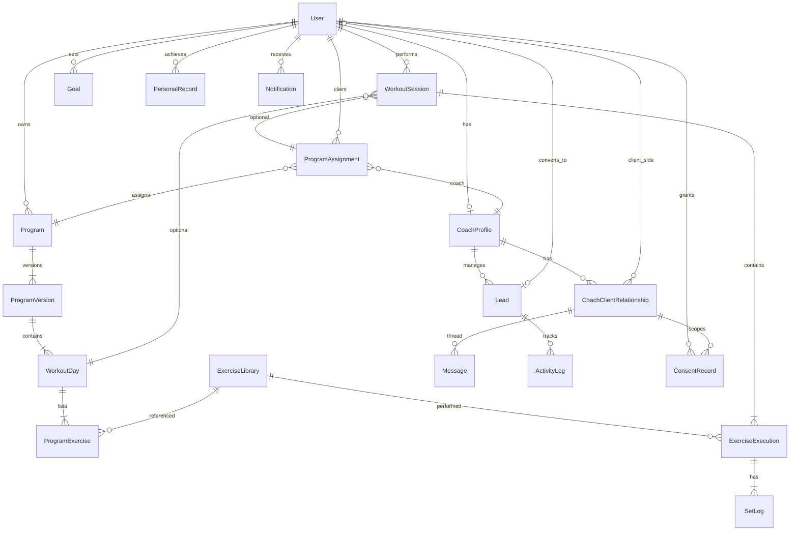
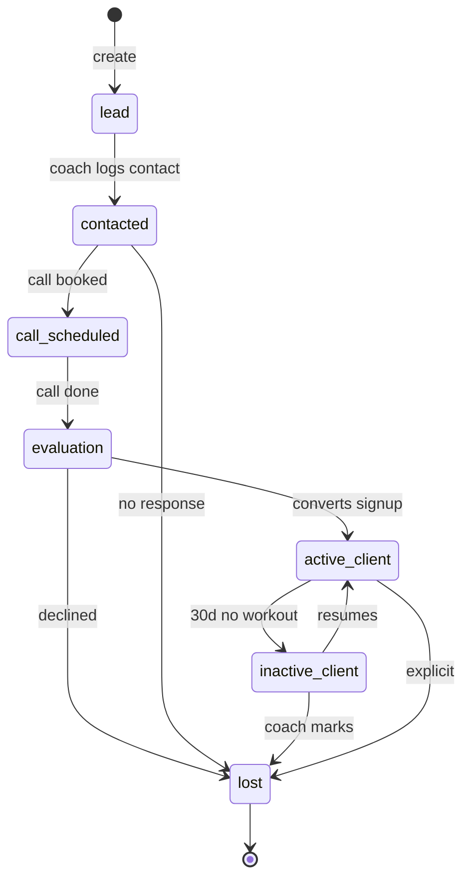
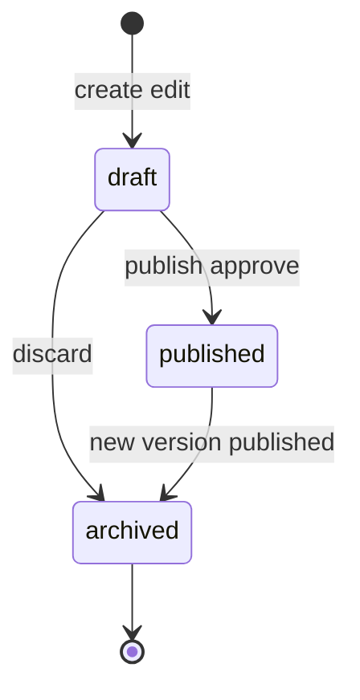
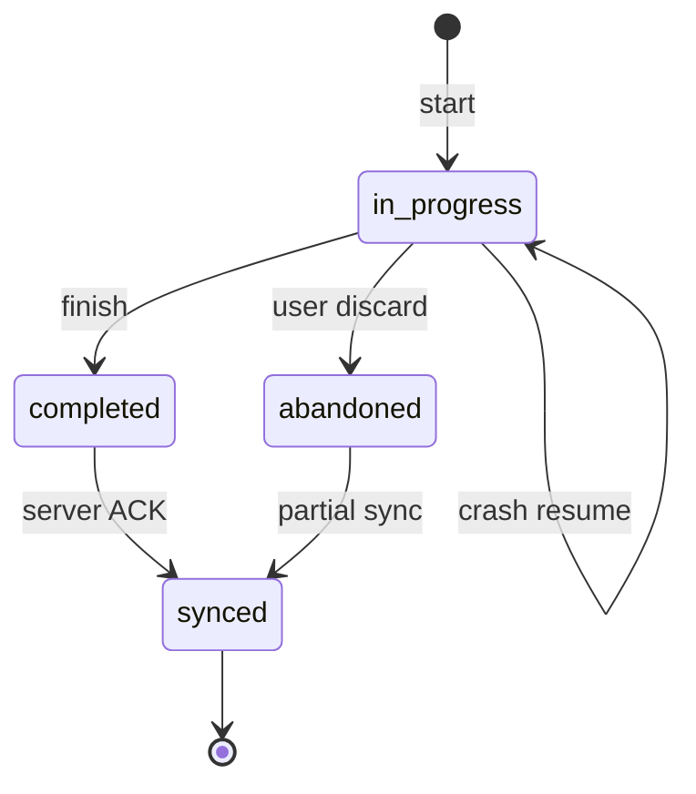
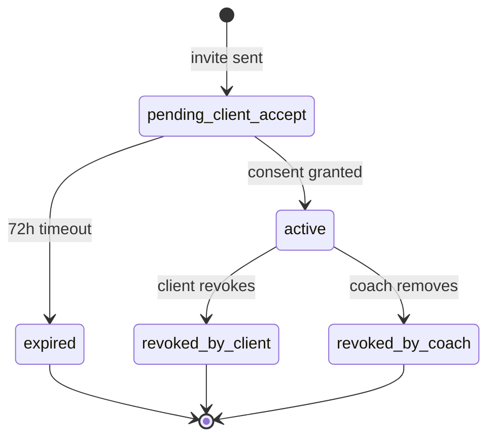

# OneMore — Data Model & Entity Lifecycle

**Version:** 1.1  
**Parent document:** [OneMore_PRD_Enterprise_v1.md](../../OneMore_PRD_Enterprise_v1.md)  
**Architecture:** [Technical Spec v1](../Technical_Spec_v1.md) | [ADR 0004](../adr/0004-database-and-persistence.md)

---

## 1. Overview

This document expands PRD Section 24 with relationships, key attributes, indexes, lifecycle states, and ER diagrams. Implementation uses PostgreSQL.

**Naming:** `snake_case` tables; UUID primary keys (`id`); all tables include `created_at`, `updated_at`; soft delete via `deleted_at` where noted.

---

## 2. Core ER Diagram



---

## 3. Entity Definitions

### 3.1 User

| Column | Type | Notes |
|--------|------|-------|
| id | UUID PK | |
| email | VARCHAR UNIQUE | |
| password_hash | VARCHAR | nullable if OAuth |
| display_name | VARCHAR | |
| username | VARCHAR UNIQUE | case-insensitive; see username policy |
| username_changed_at | TIMESTAMP | enforces change cooldown |
| birth_year | INT | not full DOB; min age 16 |
| locale | VARCHAR | `it` or `en` default |
| height_cm | DECIMAL | |
| weight_kg | DECIMAL | latest profile weight |
| role_flags | JSONB | `["athlete","coach"]` |
| timezone | VARCHAR | IANA |
| motivation_level | INT | 1, 2, or 3 |
| settings | JSONB | units, notifications, auto-progression |
| deleted_at | TIMESTAMP | soft delete |

**Indexes:** `email`, `username`, `deleted_at`

### 3.2 CoachProfile

| Column | Type | Notes |
|--------|------|-------|
| id | UUID PK | |
| user_id | UUID FK → User UNIQUE | |
| bio | TEXT | |
| business_name | VARCHAR | optional |

One coach profile per user with coach role.

### 3.3 CoachClientRelationship

| Column | Type | Notes |
|--------|------|-------|
| id | UUID PK | |
| coach_profile_id | UUID FK | |
| client_user_id | UUID FK → User | |
| status | ENUM | see lifecycle |
| role | ENUM | `primary`, `secondary` (MVP-3) |
| invite_token_hash | VARCHAR | nullable after active |
| invited_at | TIMESTAMP | |
| activated_at | TIMESTAMP | |
| revoked_at | TIMESTAMP | |
| revoked_by | ENUM | `client`, `coach` |

**Indexes:** `(coach_profile_id, client_user_id)` UNIQUE, `(client_user_id, status)`

### 3.4 Lead

| Column | Type | Notes |
|--------|------|-------|
| id | UUID PK | |
| coach_profile_id | UUID FK | |
| name | VARCHAR | |
| contact_email | VARCHAR | |
| contact_phone | VARCHAR | optional |
| source | VARCHAR | |
| objective | TEXT | |
| notes | TEXT | |
| pipeline_status | ENUM | see lifecycle |
| converted_user_id | UUID FK → User | nullable |
| lost_reason | TEXT | |

### 3.5 Program

| Column | Type | Notes |
|--------|------|-------|
| id | UUID PK | |
| owner_user_id | UUID FK | athlete or coach |
| name | VARCHAR | |
| description | TEXT | |
| objective | ENUM | mass, strength, etc. |
| author_type | ENUM | `self`, `coach`, `template` |
| is_template | BOOLEAN | system templates |
| deleted_at | TIMESTAMP | |

### 3.6 ProgramVersion

| Column | Type | Notes |
|--------|------|-------|
| id | UUID PK | |
| program_id | UUID FK | |
| version_number | INT | sequential per program |
| previous_version_id | UUID FK | nullable |
| status | ENUM | `draft`, `published`, `archived` |
| published_at | TIMESTAMP | |
| change_reason | ENUM | `manual`, `progression`, `coach_edit` |

**Index:** `(program_id, version_number)` UNIQUE

### 3.7 WorkoutDay

| Column | Type | Notes |
|--------|------|-------|
| id | UUID PK | |
| program_version_id | UUID FK | |
| label | VARCHAR | "Day A", "Push", etc. |
| sort_order | INT | |
| day_index | INT | 0-based within version |

### 3.8 ExerciseLibrary

Global exercise catalog + user custom exercises.

| Column | Type | Notes |
|--------|------|-------|
| id | UUID PK | |
| name | VARCHAR | |
| description | TEXT | |
| category | VARCHAR | |
| primary_muscles | JSONB | `["chest","triceps"]` |
| secondary_muscles | JSONB | |
| equipment | VARCHAR | |
| is_bodyweight | BOOLEAN | |
| owner_user_id | UUID FK | null = system |
| deleted_at | TIMESTAMP | |

### 3.9 ProgramExercise

Exercise slot within a workout day (prescription).

| Column | Type | Notes |
|--------|------|-------|
| id | UUID PK | |
| workout_day_id | UUID FK | |
| exercise_library_id | UUID FK | |
| sort_order | INT | |
| target_sets | INT | |
| target_reps | INT | |
| target_weight_kg | DECIMAL | nullable |
| rest_seconds | INT | |
| target_rpe | DECIMAL | optional |
| target_rir | INT | optional |
| progression_mode | ENUM | linear, double, volume, intensity |
| progression_config | JSONB | increment, rep range, etc. |
| is_warmup | BOOLEAN | default false |

### 3.10 ProgramAssignment

Links a published program version to a client.

| Column | Type | Notes |
|--------|------|-------|
| id | UUID PK | |
| program_id | UUID FK | |
| program_version_id | UUID FK | current active version |
| client_user_id | UUID FK | |
| assigned_by_coach_id | UUID FK | nullable if self |
| status | ENUM | `active`, `completed`, `paused` |
| started_at | TIMESTAMP | |

### 3.11 WorkoutSession

| Column | Type | Notes |
|--------|------|-------|
| id | UUID PK | client-generated UUID for offline |
| user_id | UUID FK | |
| program_assignment_id | UUID FK | nullable (free workout) |
| workout_day_id | UUID FK | nullable |
| status | ENUM | see lifecycle |
| started_at | TIMESTAMP | |
| completed_at | TIMESTAMP | |
| duration_seconds | INT | |
| session_type | ENUM | `programmed`, `free` |
| private_notes | TEXT | |
| sync_status | ENUM | `local`, `synced`, `failed` |
| client_updated_at | TIMESTAMP | |

**Indexes:** `(user_id, started_at)`, `(user_id, status)`

### 3.12 ExerciseExecution

| Column | Type | Notes |
|--------|------|-------|
| id | UUID PK | |
| workout_session_id | UUID FK | |
| exercise_library_id | UUID FK | actual exercise performed |
| program_exercise_id | UUID FK | nullable if substituted |
| substituted_from_id | UUID FK | nullable |
| sort_order | INT | |
| status | ENUM | pending, in_progress, completed, substituted |

### 3.13 SetLog

| Column | Type | Notes |
|--------|------|-------|
| id | UUID PK | client UUID |
| exercise_execution_id | UUID FK | |
| set_number | INT | |
| weight_kg | DECIMAL | |
| reps | INT | |
| rpe | DECIMAL | optional |
| rir | INT | optional |
| is_warmup | BOOLEAN | |
| is_completed | BOOLEAN | |
| is_skipped | BOOLEAN | |
| client_timestamp | TIMESTAMP | |

**Index:** `(exercise_execution_id, set_number)` UNIQUE

### 3.14 PersonalRecord

| Column | Type | Notes |
|--------|------|-------|
| id | UUID PK | |
| user_id | UUID FK | |
| exercise_library_id | UUID FK | |
| pr_type | ENUM | weight_pr, volume_pr, e1rm_pr |
| value | DECIMAL | weight or e1RM depending on type |
| reps | INT | for weight_pr |
| set_log_id | UUID FK | source set |
| achieved_at | TIMESTAMP | |

**Index:** `(user_id, exercise_library_id, pr_type)`

### 3.15 Goal

| Column | Type | Notes |
|--------|------|-------|
| id | UUID PK | |
| user_id | UUID FK | |
| goal_type | ENUM | strength, bodyweight, frequency, volume |
| target_value | DECIMAL | |
| current_value | DECIMAL | computed/cached |
| exercise_library_id | UUID FK | for strength goals |
| deadline | DATE | optional |
| status | ENUM | active, achieved, abandoned |
| created_by_coach_id | UUID FK | optional |

### 3.16 Message

| Column | Type | Notes |
|--------|------|-------|
| id | UUID PK | |
| relationship_id | UUID FK → CoachClientRelationship | |
| sender_user_id | UUID FK | |
| body | TEXT | max 5000 chars |
| read_at | TIMESTAMP | nullable |
| created_at | TIMESTAMP | |

### 3.17 Notification

| Column | Type | Notes |
|--------|------|-------|
| id | UUID PK | |
| user_id | UUID FK | |
| category | ENUM | workout, progress, pr, goal, coach, system |
| title | VARCHAR | |
| body | TEXT | |
| read_at | TIMESTAMP | |
| payload | JSONB | deep link data |

### 3.18 ActivityLog (CRM)

| Column | Type | Notes |
|--------|------|-------|
| id | UUID PK | |
| lead_id | UUID FK | nullable |
| coach_profile_id | UUID FK | |
| activity_type | ENUM | call, note, message, status_change |
| content | TEXT | |
| metadata | JSONB | |

### 3.19 ConsentRecord

| Column | Type | Notes |
|--------|------|-------|
| id | UUID PK | |
| user_id | UUID FK | |
| relationship_id | UUID FK | nullable |
| consent_type | VARCHAR | |
| consent_version | VARCHAR | |
| granted | BOOLEAN | |
| scopes | JSONB | |
| ip_hash | VARCHAR | |
| recorded_at | TIMESTAMP | |

### 3.20 AnalyticsSnapshot (weekly, MVP-3)

| Column | Type | Notes |
|--------|------|-------|
| id | UUID PK | |
| user_id | UUID FK | |
| iso_week | VARCHAR | `2026-W10` |
| progress_score | INT | |
| weekly_volume | DECIMAL | |
| frequency | INT | |
| streak_weeks | INT | |
| algo_version | VARCHAR | |

---

## 4. Lifecycle State Machines

### 4.1 Lead Pipeline



**Conversion:** `evaluation → active_client` sets `converted_user_id` when lead creates account and accepts coach link.

### 4.2 Program Version



Only one `published` version per program at a time. Assignments point to specific version; coach publish creates new version and updates assignment pointer.

### 4.3 Workout Session



### 4.4 CoachClientRelationship



---

## 5. User ↔ Coach ↔ Client Resolution

```
User (role_flags includes "coach") ──1:1── CoachProfile
User (any) ──may be── client_user_id in CoachClientRelationship
Client IS a User — no separate Client table
Lead converts to User + CoachClientRelationship, not a separate Client entity
```

**Deprecated from original PRD:** standalone `Client` entity → use `User` + `CoachClientRelationship`.

---

## 6. Index Strategy (Performance)

| Query pattern | Index |
|---------------|-------|
| Client workouts by date | `workout_session(user_id, started_at DESC)` |
| Coach client list | `coach_client_relationship(coach_profile_id, status)` |
| Sync pending | `workout_session(sync_status) WHERE sync_status != synced` |
| PR lookup | `personal_record(user_id, exercise_library_id, pr_type)` |
| Messages thread | `message(relationship_id, created_at)` |
| Notifications unread | `notification(user_id, read_at) WHERE read_at IS NULL` |

---

## 7. Username change policy

| Rule | Enforcement |
|------|-------------|
| First change after signup | Allowed anytime |
| Second change | ≥30 days after first change |
| Subsequent changes | Max 1 per 6 months |
| Storage | `username_changed_at` on `user` |

---

## 8. Additional technical entities

### 8.1 AuditLog

| Column | Type | Notes |
|--------|------|-------|
| id | UUID PK | |
| actor_user_id | UUID FK | |
| action | VARCHAR | e.g. `coach_viewed_client_workouts` |
| resource_type | VARCHAR | |
| resource_id | UUID | |
| metadata | JSONB | no PII |
| ip_hash | VARCHAR | |
| created_at | TIMESTAMP | |

Coach **read** and **write** access to client data always logged.

### 8.2 SystemSettings (admin)

| Column | Type | Notes |
|--------|------|-------|
| key | VARCHAR PK | |
| value | JSONB | |
| updated_by | UUID FK | |

Keys: `max_profile_image_mb`, `max_exercise_image_mb`, `max_video_mb`, `max_video_duration_sec`, allowed MIME lists.

### 8.3 MediaAsset (MVP-2+)

| Column | Type | Notes |
|--------|------|-------|
| id | UUID PK | |
| owner_user_id | UUID FK | |
| asset_type | ENUM | profile, exercise_image, exercise_video |
| r2_key | VARCHAR | |
| mime_type | VARCHAR | |
| size_bytes | INT | |
| deleted_at | TIMESTAMP | |

### 8.4 SyncIdempotency

| Column | Type | Notes |
|--------|------|-------|
| key | VARCHAR PK | Idempotency-Key header |
| response_body | JSONB | |
| expires_at | TIMESTAMP | 24h TTL |

### 8.5 OidcProviderConfig (Enterprise stub)

Inactive until Enterprise tier — see ADR 0010.

### 8.6 Message encryption (MVP-2)

`message` table adds: `body_encrypted` BYTEA, `nonce` — no plaintext `body` at rest.

---

## 9. Audit scope

`audit_log` records:

- All coach **reads** on client PII, workouts, analytics
- All writes on: `user`, `coach_client_relationship`, `consent_record`, `program_version`, `program_assignment`, `workout_session`, `lead`

---

## 10. Migration Phases

| Phase | Tables |
|-------|--------|
| MVP-1 | User, Program, ProgramVersion, WorkoutDay, ExerciseLibrary, ProgramExercise, WorkoutSession, ExerciseExecution, SetLog, PersonalRecord, Notification, ConsentRecord, AuditLog, SyncIdempotency |
| MVP-2 | CoachProfile, CoachClientRelationship, ProgramAssignment, Message (encrypted), MediaAsset, SystemSettings, CoachSubscription |
| MVP-3 | Lead, ActivityLog, Goal, AnalyticsSnapshot + progression fields |
| V4 | StripeConnectAccount, MarketplaceListing, MarketplacePurchase |
| Enterprise | OidcProviderConfig |

### CoachSubscription (V2)

| Column | Type | Notes |
|--------|------|-------|
| id | UUID PK | |
| coach_profile_id | UUID FK UNIQUE | |
| stripe_customer_id | VARCHAR | |
| stripe_subscription_id | VARCHAR | nullable when free tier |
| tier | ENUM | `free`, `pro` |
| status | ENUM | `active`, `past_due`, `canceled` |
| active_client_limit | INT | default 3 for free; null/unlimited for pro |
| price_eur_cents | INT | system default 2900 — placeholder |

Free tier: max **3** active clients enforced in API before link/activate 4th client.
