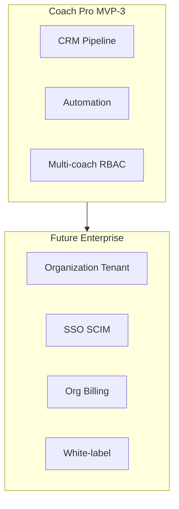

# OneMore — Enterprise Positioning Decision

**Version:** 1.0  
**Status:** Decision record  
**Parent document:** [OneMore_PRD_Enterprise_v1.md](../../OneMore_PRD_Enterprise_v1.md)

---

## 1. Decision

**Rename the product tier from "Enterprise" to "Coach Pro" for the coach-facing platform.**

The main PRD title `OneMore PRD Enterprise v1.0` should be understood as the **full product specification** (athlete + coach), not as B2B enterprise software. A future **OneMore Enterprise** tier will be defined separately when gym-chain and organization requirements are validated.

| Term | Meaning in OneMore |
|------|-------------------|
| **Athlete** | Independent user (no coach) |
| **Client** | User linked to one or more coaches |
| **Coach Lite** | MVP-2 coach features |
| **Coach Pro** | MVP-3 coach platform (CRM, automation, progression) |
| **Enterprise** | Future B2B tier — **not in MVP scope** |

---

## 2. Rationale

### Why "Enterprise" was misleading

The original PRD title implied:

- Multi-tenant organizations (gyms, chains)
- SSO, admin consoles, seat-based billing
- White-label and API partnerships

None of these appear in the v1 feature set. Stakeholders reading "Enterprise" expect Salesforce-grade B2B capabilities that would delay MVP by 6+ months.

### Why "Coach Pro" fits MVP-3

MVP-3 delivers a **professional coach workstation**: CRM, client management, automation, analytics, and program tooling. This maps to competitors like Trainerize and TrueCoach — "Pro" coach tools, not enterprise gym software.

---

## 3. What Coach Pro Includes (MVP-3)

Covered in [OneMore_MVP_MoSCoW.md](./OneMore_MVP_MoSCoW.md) MVP-3:

- Full CRM pipeline and activity log
- Coach automation and notification center
- Multi-coach RBAC
- Progression engine with approval workflow
- Progress intelligence and goal system
- Web dashboard optimized for coaches

---

## 4. Future OneMore Enterprise Tier (Post-V4)

Reserved for validated B2B demand. **Not specced for implementation** until:

- At least 3 gym/studio design partners commit
- Legal review of multi-location data isolation
- Pricing model validated (per-seat vs per-location)

### Planned Enterprise capabilities (draft backlog)

| Capability | Description | Priority when started |
|------------|-------------|----------------------|
| Organization entity | Gym/studio as tenant root | P0 |
| Org admin role | Manage coaches and clients under org | P0 |
| SSO (OIDC/SAML) | Google Workspace, Microsoft Entra | P0 |
| Seat licensing | Admin assigns coach seats | P0 |
| Location hierarchy | Chain → branch → coach | P1 |
| Centralized billing | Invoice, contracts, usage reports | P1 |
| White-label (basic) | Logo, colors, custom domain | P2 |
| SCIM provisioning | Automated user lifecycle | P2 |
| API access | Read client/workout data for integrations | P2 |
| Audit export | Compliance reports for org admins | P1 |
| Data residency options | EU-only storage per org | P3 |

### Enterprise vs Coach Pro boundary

Coach Pro coaches operate as **individual tenants**. Enterprise adds an **organization layer above coaches** without changing the coach-client data model.

---

## 5. Document Naming Convention (Going Forward)

| Document | Purpose |
|----------|---------|
| `OneMore_PRD_Enterprise_v1.md` | Master feature outline (legacy name; content = full product) |
| `docs/prd/OneMore_MVP_MoSCoW.md` | Phased scope |
| `docs/prd/OneMore_Enterprise_Positioning.md` | This decision record |
| `docs/prd/OneMore_Enterprise_Spec.md` | **Future** — written when Enterprise tier starts |

---

## 6. Action Items Completed

- [x] Clarify naming: Coach Pro ≠ Enterprise
- [x] Defer B2B requirements to future spec
- [x] Prevent MVP scope creep from enterprise features

### Recommended follow-up (product, not engineering)

- Update marketing/materials to use "Coach Pro" for coach platform
- When ready for Enterprise discovery, run 5 interviews with gym owners using the draft backlog above
