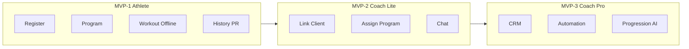

# OneMore — MVP Scope & MoSCoW Prioritization

**Version:** 1.1  
**Status:** Approved for implementation planning  
**Parent document:** [OneMore_PRD_Enterprise_v1.md](../../OneMore_PRD_Enterprise_v1.md)  
**Architecture:** [Technical Spec v1](../Technical_Spec_v1.md)

---

## 1. Problem Statement

The original PRD (Section 27) lists nearly every feature as MVP scope. This document replaces that section with a phased, realistic release plan aligned with the **Coach Optional** principle: the independent athlete loop must be solid before coach platform investment.

**Platform V1:** Single responsive **web SPA + PWA** (not native mobile). Coach uses the same web app on phone and desktop (MVP-2). Native apps evaluated post-V1.

---

## 2. Release Phases Overview

| Phase | Name | Target | Primary audience |
|-------|------|--------|------------------|
| **MVP-1** | Athlete Core | 8–10 weeks | Independent athletes |
| **MVP-2** | Coach Lite | 6–8 weeks | Personal trainers (early adopters) |
| **MVP-3** | Coach Pro | 8–10 weeks | Coaches at scale |
| **V2** | Engagement | Post-MVP | Athletes + coaches |
| **V3+** | Platform | Roadmap | Ecosystem |

---

## 3. MVP-1 — Athlete Core Loop

**Goal:** A user can register, build or receive a program, execute workouts reliably (including offline), and review history and basic progress.

### Must Have

| ID | Feature | Acceptance summary |
|----|---------|-------------------|
| M1-01 | Account registration & login | Email + password; Apple + Google OAuth; password reset; session persistence |
| M1-02 | Minimal onboarding | Goals, level, availability, environment; **no auto-program generation** |
| M1-03 | Manual program creation | Name, days (custom labels), exercises with sets/reps/weight/rest |
| M1-04 | Program templates (3–5 presets) | Beginner gym/home splits selectable at onboarding |
| M1-05 | Workout execution | 1–2 tap set logging; weight/reps edit; complete/skip; rest timer |
| M1-06 | Offline workout mode | Full session without network; sync on reconnect |
| M1-07 | Exercise library (core) | ~150 exercises; search; custom exercise creation |
| M1-08 | Workout history | List + detail per session; filter by date |
| M1-09 | Basic analytics | Volume per workout/week; consistency (sessions/week); streak |
| M1-10 | Personal records (PR) | Auto-detect on weight×reps improvement per exercise |
| M1-11 | Free workouts | Ad-hoc sessions; counted in history and streak |
| M1-12 | Notifications (basic) | Workout reminder (user-configured); PR celebration |
| M1-13 | GDPR baseline | Consent at signup; data export; account deletion |

### Should Have

| ID | Feature |
|----|---------|
| S1-01 | Auto-fill previous session values during workout |
| S1-02 | Session notes (private) |
| S1-03 | Dashboard widgets: next workout, last workout, streak, recent PRs |
| S1-04 | Exercise substitution during workout |

### Could Have

| ID | Feature |
|----|---------|
| C1-01 | RPE/RIR logging (optional per set) |
| C1-02 | Body weight manual log |
| C1-03 | Dark mode |

### Won't Have (MVP-1)

- Coach platform, CRM, messaging
- Progression engine (automatic)
- Plateau detection, Progress Score
- Goal system beyond streak
- Motivation levels 2–3 interventions
- Multi-coach, QR linking
- Desktop coach dashboard

### MVP-1 Go-Live Criteria

- [ ] 95% of workout sessions complete without sync failure (beta cohort, 50 users)
- [ ] p95 set-log interaction ≤ 2 taps (see [OneMore_Workout_NFR.md](./OneMore_Workout_NFR.md))
- [ ] Onboarding completion rate ≥ 60% in beta
- [ ] Time to first workout ≤ 10 minutes from signup (median)
- [ ] Zero P0 security issues; GDPR export/deletion functional

---

## 4. MVP-2 — Coach Lite

**Goal:** A coach can invite clients, assign programs, view client workouts, and message clients.

### Must Have

| ID | Feature |
|----|---------|
| M2-01 | Coach account type (upgrade from athlete or separate signup) |
| M2-02 | Client linking via invite link / username (single-use, expiring) |
| M2-03 | Client consent flow before data sharing (GDPR) |
| M2-04 | Coach assigns program template to client |
| M2-05 | Coach client list (active/inactive filter) |
| M2-06 | Coach client detail: active program, last 5 workouts, streak |
| M2-07 | Text messaging (coach ↔ client) |
| M2-08 | Coach session notes visible to client during workout |
| M2-09 | Basic coach dashboard: client count, clients inactive 7+ days |
| M2-10 | Notification: coach message; client missed workout (coach opt-in) |

### Should Have

| ID | Feature |
|----|---------|
| S2-01 | Coach edits client's assigned program |
| S2-02 | Lead capture (name, contact, notes) — **no full pipeline** |
| S2-03 | Coach routes in same web app (responsive phone + desktop) |

### Won't Have (MVP-2)

- Full CRM pipeline stages
- Coach automation / alerts engine
- Multi-coach per client
- Progression engine automation
- Revenue reporting

### MVP-2 Go-Live Criteria

- [ ] Coach can onboard first client end-to-end in &lt; 15 minutes
- [ ] Client consent recorded before coach sees workout data
- [ ] Message delivery &lt; 5s p95 when online

---

## 5. MVP-3 — Coach Pro

**Goal:** Scale coach operations with CRM, automation, analytics, and progression support.

### Must Have

| ID | Feature |
|----|---------|
| M3-01 | Full CRM pipeline (Lead → Lost) with activity log |
| M3-02 | Coach automation: inactivity alert, adherence alert |
| M3-03 | Multi-coach per client with RBAC (see [OneMore_RBAC_Privacy.md](./OneMore_RBAC_Privacy.md)) |
| M3-04 | Progression engine (linear + double progression) with coach approval |
| M3-05 | Progress intelligence: e1RM trends, volume analytics, plateau detection |
| M3-06 | Goal system (strength, bodyweight, frequency, volume) |
| M3-07 | Motivation system (levels 1–3 unified — see [OneMore_Motivation_System_Spec.md](./OneMore_Motivation_System_Spec.md)) |
| M3-08 | Notification center (all categories) |
| M3-09 | Advanced history search and export (CSV) |
| M3-10 | Onboarding auto-program generation (rule-based) |

### Should Have

| ID | Feature |
|----|---------|
| S3-01 | "At risk of churn" client filter |
| S3-02 | Coach suggestions queue (clients to contact, programs to review) |
| S3-03 | Progress Score on athlete dashboard |

### Won't Have (MVP-3)

- Marketplace, smartwatch, photo check-ins (V2+)
- Enterprise B2B (SSO, org billing) — see [OneMore_Enterprise_Positioning.md](./OneMore_Enterprise_Positioning.md))

---

## 6. MoSCoW Matrix (Consolidated)

| Capability | MVP-1 | MVP-2 | MVP-3 | V2+ |
|------------|-------|-------|-------|-----|
| Onboarding (minimal) | Must | — | — | — |
| Onboarding (auto-program) | Won't | Won't | Must | — |
| Manual programs | Must | Must | Must | — |
| Workout offline | Must | Must | Must | — |
| Exercise library | Must | Must | Must | — |
| Basic analytics | Must | Must | Must | — |
| PR detection | Must | Must | Must | — |
| Coach linking | Won't | Must | Must | — |
| Messaging | Won't | Must | Must | V2 attachments |
| CRM pipeline | Won't | Won't | Must | — |
| Automation alerts | Won't | Won't | Must | — |
| Progression engine | Won't | Won't | Must | — |
| Plateau detection | Won't | Won't | Must | — |
| Progress Score | Won't | Won't | Should | — |
| Multi-coach | Won't | Won't | Must | — |
| Photo check-in | Won't | Won't | Won't | V2 |
| Smartwatch | Won't | Won't | Won't | V3 |
| Marketplace | Won't | Won't | Won't | V4 |

---

## 7. Out of Scope (Global v1)

Explicitly excluded from all MVP phases:

- Organization / gym multi-tenant admin
- SSO (SAML/OIDC) and SCIM provisioning
- Payment processing and subscriptions (deferred to monetization phase)
- Social features (public profiles, leaderboards)
- Video hosting for exercises (GIF/static images only in MVP-1)
- Medical/clinical health integrations (V3 regulatory review required)
- Native desktop apps (responsive web for coach in MVP-2+)

---

## 8. Git Strategy Recommendation

| Phase | Branch strategy |
|-------|-----------------|
| MVP-1 | `main` with feature branches `feat/mvp1-*` |
| MVP-2 | `release/mvp-2` branch after MVP-1 tag `v0.1.0` |
| MVP-3 | `release/mvp-3` branch after `v0.2.0` |
| V2 billing | Stripe Coach Pro after MVP-2 stable — freemium 3 clients ([ADR 0011](../adr/0011-monetization-and-legal-model.md)) |

Tag each phase at go-live. Do not merge coach CRM into MVP-1 codebase paths until MVP-2 to reduce coupling risk.

---

## 9. Replacement for PRD Section 27

The original Section 27 MVP scope is **superseded** by this document. Implementation teams should reference phase IDs (M1-01, M2-04, etc.) in tickets and acceptance tests.
