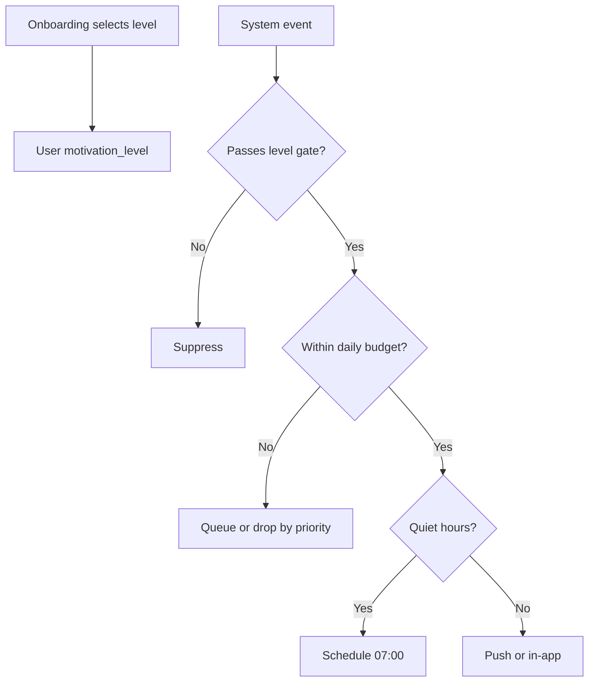

# OneMore — Motivation System Specification (Unified)

**Version:** 1.0  
**Applies from:** MVP-1 (Level 1) and MVP-3 (Levels 2–3, full system)  
**Parent document:** [OneMore_PRD_Enterprise_v1.md](../../OneMore_PRD_Enterprise_v1.md)

This document unifies PRD Sections 6 (onboarding motivation) and 16 (motivation system) and defines anti-spam rules with notifications and coach automation.

---

## 1. Motivation Levels (Single Definition)

Selected during onboarding (`User.motivation_level`). User can change in Settings → Motivation.

| Level | Name | User intent | System behavior |
|-------|------|-------------|-----------------|
| **1** | Quiet Tracker | Log workouts; minimal interruptions | Tracking, streak, PR badges only; no proactive nudges |
| **2** | Guided | Reminders when slipping; celebrate wins | Smart reminders + milestone notifications; coach alerts if coached |
| **3** | High Support | Frequent encouragement and check-ins | All Level 2 + weekly progress digest + coach automation enabled |

### 1.1 Onboarding UX

- Present as 3 cards with examples, not numeric labels in UI
- Default if skipped: **Level 2**
- Stored as `motivation_level` integer 1–3

### 1.2 Coach override (MVP-3)

Coach cannot change client motivation level. Coach automation respects client level (Section 4).

---

## 2. Components by Level

### 2.1 Shared (all levels)

| Component | Description |
|-----------|-------------|
| Streak | Weekly streak per [Algorithm Spec](./OneMore_Algorithm_Spec.md) |
| Achievements | Milestone badges (see Section 3) |
| PR celebration | In-app modal on new PR (dismissible) |
| Progress views | History, basic analytics |

### 2.2 Level 1 only extras

- None beyond shared (no push except critical account/security)

### 2.3 Level 2 additions

| Component | Trigger | Channel |
|-----------|---------|---------|
| Workout reminder | User-scheduled days/times | Push (if enabled) |
| Streak at risk | No workout by day 6 of week | Push once |
| Milestone achievement | Achievement unlocked | Push + in-app |
| Weekly summary | Sunday 18:00 local | In-app card |

### 2.4 Level 3 additions

| Component | Trigger | Channel |
|-----------|---------|---------|
| Weekly progress digest | Sunday 10:00 local | Push + email (if opted in) |
| Encouragement nudge | 3+ day gap mid-week | Push (max 2/week) |
| Progress Score highlight | Weekly score update | In-app |
| Coach check-in prompt | Client Level 3 + coached | Coach automation (Section 4) |

---

## 3. Achievement System

### 3.1 MVP-1 achievements

| ID | Name | Condition |
|----|------|-----------|
| `first_workout` | First Step | 1 completed session |
| `workouts_10` | Getting Started | 10 completed sessions |
| `workouts_50` | Consistent | 50 completed sessions |
| `workouts_100` | Century | 100 completed sessions |
| `streak_4` | Month Strong | 4-week streak |
| `streak_12` | Year Builder | 12-week streak |
| `first_pr` | New Peak | First PR any exercise |

### 3.2 MVP-3 achievements

| ID | Name | Condition |
|----|------|-----------|
| `pr_5` | PR Machine | 5 distinct exercise PRs |
| `goal_achieved` | Goal Crusher | Any goal status → achieved |
| `coach_linked` | Coached | Active coach relationship |

### 3.3 Display rules

- In-app badge gallery in Profile
- Push for achievement only if motivation ≥ 2 and category enabled
- No leaderboard / social comparison in v1

---

## 4. Integration with Coach Automation

Coach automation (MVP-3) respects client `motivation_level`:

| Automation | Level 1 | Level 2 | Level 3 |
|------------|---------|---------|---------|
| Inactivity alert to coach | 14 days | 10 days | 7 days |
| Adherence alert to coach | Off | On | On |
| Check-in reminder to coach | Off | Off | On (weekly) |
| Client nudge (system to client) | Off | Streak at risk only | + encouragement nudges |

**Terminology alignment:**

- **V1 automation "check-in reminder"** = coach prompt to message client (not structured photo check-in)
- **V2 "check-in"** = structured client form with photos — separate feature, does not replace coach prompt

---

## 5. Anti-Spam & Notification Budget

### 5.1 Global caps (per user per day)

| Motivation level | Max push/day | Max push/week |
|------------------|--------------|---------------|
| 1 | 0 (except security) | 0 |
| 2 | 2 | 8 |
| 3 | 3 | 12 |

### 5.2 Priority queue (when budget exceeded)

Drop lowest priority first:

1. Security / account (never dropped)
2. Coach message
3. PR celebration
4. Achievement
5. Streak at risk
6. Encouragement nudge
7. Weekly digest

### 5.3 Quiet hours

- Default: 22:00–07:00 user timezone
- No push during quiet hours except coach messages (user can disable)
- Queue for 07:00 delivery

### 5.4 Cooldown rules

| Notification type | Min cooldown |
|-------------------|--------------|
| Streak at risk | 7 days |
| Encouragement nudge | 48 hours |
| Weekly digest | 7 days |
| Same achievement | once ever |

### 5.5 User preferences (Settings → Notifications)

Granular toggles per category (workout, progress, PR, goal, coach, system) — overrides level defaults except Level 1 caps (cannot enable marketing nudges above cap).

---

## 6. Progress Score Integration

- Progress Score (MVP-3) displayed on dashboard for Level 2–3
- Level 1: hidden by default; available in analytics if user seeks it
- Weekly update per [Algorithm Spec](./OneMore_Algorithm_Spec.md)

---

## 7. Free Workouts & Motivation

| Metric | Free workout counts? |
|--------|---------------------|
| Streak | Yes (if completion rules met) |
| Achievements (session count) | Yes |
| PR | Yes |
| Adherence (programmed) | No — free workouts don't count toward planned adherence |
| Progress Score consistency | Yes (frequency component) |

---

## 8. Acceptance Criteria

| ID | Criterion |
|----|-----------|
| AC-MOT-01 | Level 1 user receives zero push in 7-day period with normal usage |
| AC-MOT-02 | Level 3 user never receives &gt; 3 push in 24h |
| AC-MOT-03 | Quiet hours block streak-at-risk until 07:00 |
| AC-MOT-04 | Changing level 3 → 1 cancels pending non-security notifications |
| AC-MOT-05 | Coach inactivity alert fires at 7d for Level 3 client, 14d for Level 1 |
| AC-MOT-06 | Achievement `first_workout` fires exactly once |

---

## 9. Flow Diagram

