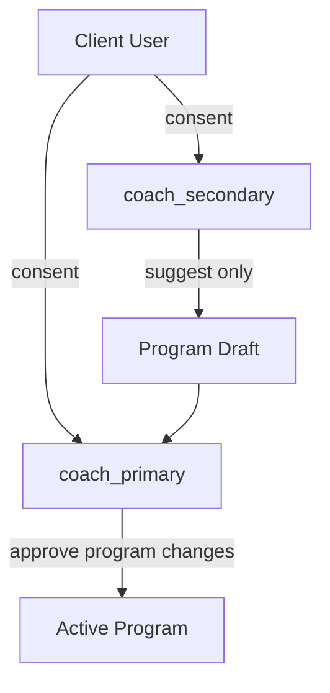

# OneMore — RBAC & Privacy (GDPR) Specification

**Version:** 1.3  
**Applies from:** MVP-2 (coach linking) and MVP-3 (multi-coach)  
**Parent document:** [OneMore_PRD_Enterprise_v1.md](../../OneMore_PRD_Enterprise_v1.md)  
**Architecture:** [Technical Spec v1](../Technical_Spec_v1.md) | [ADR 0006](../adr/0006-authentication-and-identity.md)

---

## 1. Role Model

### 1.1 Roles

| Role | Description | MVP phase |
|------|-------------|-----------|
| `athlete` | Independent user, no coach link | MVP-1 |
| `client` | User with ≥1 active coach relationship | MVP-2 |
| `coach` | User with coach capabilities enabled | MVP-2 |
| `coach_primary` | Designated lead coach on a client (multi-coach) | MVP-3 |
| `coach_secondary` | Additional coach with limited write access | MVP-3 |
| `admin` | Internal OneMore operations (support) | Post-MVP |

A single `User` can hold `athlete` + `coach` simultaneously (trainer who also works out).

### 1.2 Role assignment

- `coach` enabled via coach signup or upgrade flow (MVP-2)
- `client` auto-assigned when coach link accepted
- `coach_primary` / `coach_secondary` assigned per `CoachClientRelationship` (MVP-3)

---

## 2. RBAC Permission Matrix

Legend: **R** Read, **W** Write, **C** Create, **D** Delete, **—** No access

### 2.1 Own athlete data (user is the subject)

| Resource | athlete | client |
|----------|---------|--------|
| Own profile | RW | RW |
| Own programs | RWC | RWC |
| Own workout sessions | RWC | RWC |
| Own goals | RWC | RWC |
| Own messages | RWC | RWC |
| Own notifications | R | R |

### 2.2 Coach access to client data

| Resource | coach (single) | coach_primary | coach_secondary |
|----------|----------------|---------------|-----------------|
| Client profile (name, goals, level) | R | RW | R |
| Client body metrics (weight, etc.) | R | RW | R |
| Client assigned program | RW | RW | R |
| Client workout sessions | R | R | R |
| Client workout session notes (coach) | RW | RW | R |
| Client private session notes | — | — | — |
| Client PR / analytics | R | R | R |
| Client goals | RW | RW | R |
| Messages with client | RWC | RWC | RWC |
| CRM lead (own) | RWC | RWC | RWC |
| Progression proposals | Approve/Reject | Approve/Reject | — |
| Terminate coach relationship | — | C (initiate) | — |

### 2.3 Client access to coach data

| Resource | client |
|----------|--------|
| Coach display name, photo | R |
| Coach bio (if set) | R |
| Coach private CRM notes on lead | — |
| Other coaches on same client | R (names only) |

### 2.4 Multi-coach rules (MVP-3)

- Maximum **3 active coaches** per client
- Only **one** `coach_primary` per client
- Program edits by `coach_secondary` create **suggestions** (draft) requiring primary approval
- Messages: each coach has separate thread with client (not shared coach-to-coach channel)
- Client can revoke any coach independently



---

## 3. Coach-Client Linking Flow

### 3.1 Invite mechanisms (MVP-2)

| Method | Security |
|--------|----------|
| Username search + request | Client must accept |
| Invite link | Single-use token, expires 72h, HTTPS only |
| QR code | Encodes same invite link; regenerates on coach refresh |

### 3.2 Link lifecycle states

```
pending_client_accept → active → revoked_by_client | revoked_by_coach | expired
```

### 3.3 Consent gate (mandatory before `active`)

Before coach sees any workout data, client must confirm:

1. **Data sharing consent:** Coach can view workouts, analytics, body metrics shared
2. **Messaging consent:** Coach can send in-app messages
3. **Optional:** Coach can add session notes visible during workout

Consent recorded: `consent_version`, `timestamp`, `ip_hash`, `scopes[]`.

**AC:** Coach API returns 403 for client workout data if relationship ≠ `active` or consent missing.

---

## 4. GDPR Compliance Specification

### 4.1 Data classification

| Category | Examples | Legal basis |
|----------|----------|-------------|
| Account data | email, password hash | Contract |
| Profile data | name, age, height, weight | Contract / Consent |
| Fitness data | workouts, PRs, analytics | Contract |
| Health-adjacent | body weight trends, goals | Explicit consent |
| Coach CRM | lead notes, call logs | Legitimate interest (coach) |
| Communications | messages | Contract |

Fitness/health data treated as **special category risk** — explicit consent at onboarding and coach link.

### 4.2 Consent management

| Consent | Required | Revocable |
|---------|----------|-----------|
| Terms of Service | Yes (signup) | Account deletion |
| Privacy Policy | Yes (signup) | Account deletion |
| Fitness data processing | Yes (onboarding) | Restricts analytics |
| Coach data sharing | Yes (on link) | Revokes coach access |
| Marketing emails | No (opt-in) | Anytime |
| Push notifications | No (opt-in per category) | Anytime |

### 4.3 Data subject rights

| Right | Implementation | SLA |
|-------|----------------|-----|
| Access (export) | JSON + CSV export in Settings | Within 30 days; target 24h automated |
| Rectification | Profile edit UI | Immediate |
| Erasure (deletion) | Account deletion flow | 30-day soft delete → hard delete |
| Restrict processing | Toggle in privacy settings | Immediate |
| Object to marketing | Unsubscribe | Immediate |
| Portability | Export format matches import schema | With export |

### 4.4 Account deletion cascade

On hard delete:

- User PII anonymized or removed
- Workout data deleted unless coach copy required — **coach sees "Client removed" stub**, historical aggregate analytics for coach retained without PII (legal review: 26 months max)
- Messages deleted both sides
- Coach relationships terminated

### 4.5 Data retention

| Data | Retention |
|------|-----------|
| Active account data | Until deletion request |
| Deleted account (soft) | 30 days recovery window |
| Audit logs | 24 months |
| Coach CRM leads (lost) | 24 months then auto-delete |
| Analytics snapshots | 36 months |
| Backups | 90 days rolling |

### 4.6 Minors policy

- Minimum age **16** (EU GDPR default; adjust per market)
- No age gate bypass
- If age &lt; 16 at signup → block registration with message
- Do not collect age from blocked users

### 4.7 International transfers

- Primary data residency: **EU** (Frankfurt or Paris region)
- Subprocessors documented in Privacy Policy
- SCCs for US subprocessors (email, analytics)

### 4.8 GDPR roles — coach vs platform (ADR 0011)

| Data | Controller | Processor |
|------|------------|-----------|
| Athlete workout, PR, analytics | Athlete (own data) | OneMore |
| Coach CRM (leads, pipeline, notes) | Coach | OneMore |
| Coach account, billing | OneMore | — |

- Coach accepts **DPA** at coach onboarding (MVP-2) before CRM access
- Athlete accepts **coach data-sharing consent** at coach-link (separate flow)
- Stripe added as subprocessor in Privacy Policy (V2)

---

## 5. Security Controls (RBAC-related)

| Control | Requirement |
|---------|-------------|
| Authentication | Email + password (`user_credential`); Apple/Google (`oauth_account`); refresh tokens in DB |
| Password | Min 8 chars, Have I Been Pwned breach check |
| Session | JWT 15min access (memory) + 7d httpOnly refresh cookie; rotate on use |
| MFA | TOTP optional — recommended for coaches MVP-2 |
| API authorization | Every resource check `user_id` + relationship scope |
| IDOR prevention | Client ID in URL must match authorized coach relationship |
| Audit log events | **All coach reads** on client data + login, consent, coach link, export, deletion, program publish |
| Messaging | E2E encryption MVP-2 — server stores ciphertext only |
| Encryption | TLS 1.2+ transit; AES-256 at rest (Postgres, R2) |

---

## 6. Threat Model (Summary)

| Threat | Mitigation |
|--------|------------|
| Coach accesses non-client data | Relationship + consent check on every query |
| Leaked invite link | Single-use, 72h expiry, coach can invalidate |
| Secondary coach escalates privileges | Suggestion-only workflow; API enforces role |
| Client unaware of data sharing | Consent screen with explicit scopes before activation |
| Export includes other users' PII | Export scoped to requesting user only |

---

## 7. Acceptance Criteria Checklist

| ID | Criterion |
|----|-----------|
| AC-RBAC-01 | Coach without `active` relationship cannot GET client workouts (403) |
| AC-RBAC-02 | Secondary coach POST program edit creates draft, not live version |
| AC-RBAC-03 | Client revoke immediately removes coach read access |
| AC-RBAC-04 | Export completes in &lt; 60s for 2 years of workout data |
| AC-RBAC-05 | Deletion removes client PII from coach client list within soft-delete window |
| AC-RBAC-06 | User age 15 blocked at registration |
| AC-RBAC-07 | Audit log entry for every consent change |
