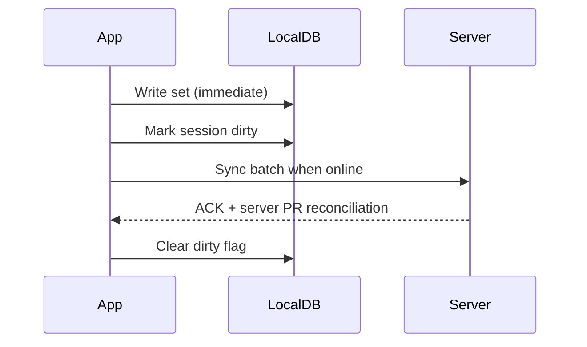

# OneMore — Workout Execution NFR & Acceptance Criteria

**Version:** 1.2  
**Applies from:** MVP-1  
**Parent document:** [OneMore_PRD_Enterprise_v1.md](../../OneMore_PRD_Enterprise_v1.md)  
**Architecture:** [Technical Spec v1](../Technical_Spec_v1.md) | [ADR 0001](../adr/0001-web-first-pwa-platform.md)

---

## 1. Purpose

Workout execution is the core experience. V1 is delivered as a **responsive web PWA** (mobile browser + installable). This document defines NFRs, offline behavior, sync protocol, crash recovery, and acceptance criteria for the **1–2 tap per set** UX target.

---

## 2. Platform Targets

| Platform | MVP-1 | Notes |
|----------|-------|-------|
| Mobile browser (iOS Safari, Android Chrome) | Must | Primary gym device; add-to-home-screen encouraged |
| PWA installed | Must | Offline via Serwist Service Worker + IndexedDB |
| Desktop browser | Should | Athlete history/analytics; coach dashboard MVP-2 |
| Native iOS/Android apps | Won't | Deferred post-V1 evaluation |

**iOS PWA caveat:** Background sync unreliable — user must open app online to sync with coach. See ADR 0001.

---

## 3. Performance NFRs

| Metric | Target | Measurement |
|--------|--------|-------------|
| Set log tap count | ≤ 2 taps (happy path) | UX test, 20 users |
| Set log latency (tap → visual confirm) | p95 ≤ 100ms | On-device, mid-range phone |
| Workout screen cold start | p95 ≤ 1.5s | From PWA icon or browser |
| Resume in-progress workout | p95 ≤ 500ms | From dashboard |
| Rest timer accuracy | ± 1 second over 5 min | Background test |
| Offline set log | p95 ≤ 50ms | No network |
| Sync after reconnect | p95 ≤ 3s for 1 session | 50 sets |

### 3.1 Happy path: 2-tap set completion

**Scenario:** User completes set with same weight/reps as pre-filled.

1. Tap **Complete set** (tap 1) — uses pre-filled weight/reps
2. Visual confirmation + rest timer auto-starts (tap 2 optional: skip rest)

**Scenario:** User changes weight only.

1. Tap weight field → adjust → confirm (counts as 1 tap if stepper used)
2. Tap **Complete set** (tap 2)

**AC-WO-01:** 90% of beta users complete a set in ≤ 2 taps when using pre-filled values.

---

## 4. Offline-First Architecture

### 4.1 Principle

Workout execution **never requires network**. Network is used for sync only.

### 4.2 Local storage

| Data | Stored locally when |
|------|---------------------|
| Active program snapshot | On program assign/open; refreshed on sync |
| Exercise library (subset) | Exercises in active program + 500 most common |
| In-progress session | Created locally on Start Workout |
| Completed sessions (pending sync) | Until server ACK |
| User preferences | Always |

Storage: **IndexedDB via Dexie.js** (V1 web). Encrypt at rest: browser sandbox (HTTPS required).

### 4.3 Offline capabilities

| Action | Offline |
|--------|---------|
| Start workout from program | Yes |
| Start free workout | Yes |
| Log sets (weight, reps, RPE, RIR) | Yes |
| Skip / substitute exercise | Yes |
| Rest timer | Yes (local notification) |
| PR detection (preview) | Yes (local algo) |
| Coach notes (read) | Yes if cached at session start |
| Session notes (write) | Yes |
| Complete workout | Yes |
| Search full exercise library | Partial (cached subset) |

### 4.4 Sync protocol



**Rules:**

- Optimistic UI — never block on network for set logging
- Sync queue: ordered by `client_timestamp`
- Idempotency key: `session_id + set_id` (client-generated UUIDs)
- Conflict: server wins on PR ties; set data merges by idempotency key (last-write-wins per set_id)
- Retry: exponential backoff 1s, 2s, 4s, max 5 min interval

### 4.5 Sync failure UX

- Badge: "Sync pending" on dashboard (non-blocking)
- After 24h pending: gentle reminder notification (max 1/day)
- Data never deleted locally until server ACK
- **`sync_status` is client-only** (IndexedDB); server stores `ingested_at` on `workout_session` — see Data Model v1.2

**AC-WO-02:** Complete 60-min workout offline → reconnect → all sets visible on server within 10s.

---

## 5. Crash Recovery

### 5.1 Session states

```
idle → in_progress → completed → synced
```

`in_progress` persisted on **every set log** (debounce max 500ms).

### 5.2 Recovery rules

| Event | Behavior |
|-------|----------|
| App crash mid-workout | On relaunch: prompt "Resume workout?" with elapsed time |
| OS kill (background) | Same as crash |
| User force-quit | Resume available for 24h |
| Device reboot | Resume available if storage intact |
| Resume declined | Session saved as `abandoned` (partial data retained) |

### 5.3 Rest timer after crash

- If crash during rest: resume with remaining time if &gt; 5s, else clear timer

**AC-WO-03:** Kill app after 3 sets → relaunch → resume shows correct set count and data.

**AC-WO-04:** No duplicate sets after resume + sync (idempotency verified).

---

## 6. Workout UX States

### 6.1 Set states

| State | Description |
|-------|-------------|
| `pending` | Not yet attempted |
| `completed` | Logged with weight/reps |
| `skipped` | User skipped |
| `failed` | User marked failed (optional, Could) |

### 6.2 Exercise states

| State | Description |
|-------|-------------|
| `pending` | Not started |
| `in_progress` | At least one set logged |
| `completed` | All sets done or skipped |
| `substituted` | Replaced with alternate exercise |

### 6.3 Substitution rules

- Original exercise marked `substituted`; new exercise linked via `substituted_from_id`
- Analytics: volume attributed to **actual** exercise performed
- PR: only on actual exercise
- Program template unchanged (substitution is session-level only)

---

## 7. Rest Timer NFR

| Setting | Default |
|---------|---------|
| Default rest | From program exercise `rest_seconds`; fallback 90s |
| Auto-start on set complete | On (user can disable) |
| Background notification | Local push when app backgrounded |
| Sound/vibration | User preference |
| Skip rest | 1 tap |
| Adjust rest mid-timer | +30s / -30s buttons |

**AC-WO-05:** Timer fires local notification when app backgrounded within ±2s of target.

---

## 8. Auto-Fill (Should — MVP-1)

Pre-fill weight/reps from **last completed session** for same exercise in same program context.

Fallback order:

1. Last session same exercise
2. Program prescribed values
3. Empty

---

## 9. Coach Notes During Workout

| MVP | Behavior |
|-----|----------|
| MVP-1 | Private session notes only |
| MVP-2 | Coach notes visible at top of exercise card if cached |

Coach notes fetched at workout start; stale if coach edits mid-workout (acceptable).

---

## 10. Accessibility (WCAG 2.1 AA)

| Requirement | Target |
|-------------|--------|
| Touch targets | Min 44×44 pt |
| Color contrast | 4.5:1 text |
| Screen reader | Set state announced on complete |
| Reduced motion | Disable animations option |
| Font scaling | Support up to 200% without layout break |

---

## 11. Battery & Background

- Workout mode reduces background refresh of non-critical services
- Rest timer uses `BGTask` / `WorkManager` — not continuous polling
- Target: &lt; 5% battery drain per 60-min workout (mid-range device)

---

## 12. Definition of Done (Workout Epic)

- [ ] All AC-WO-01 through AC-WO-05 pass on iOS and Android
- [ ] Offline sync integration test (automated)
- [ ] Crash resume E2E test
- [ ] p95 latency benchmarks documented in CI perf report
- [ ] WCAG spot-check on workout screen
